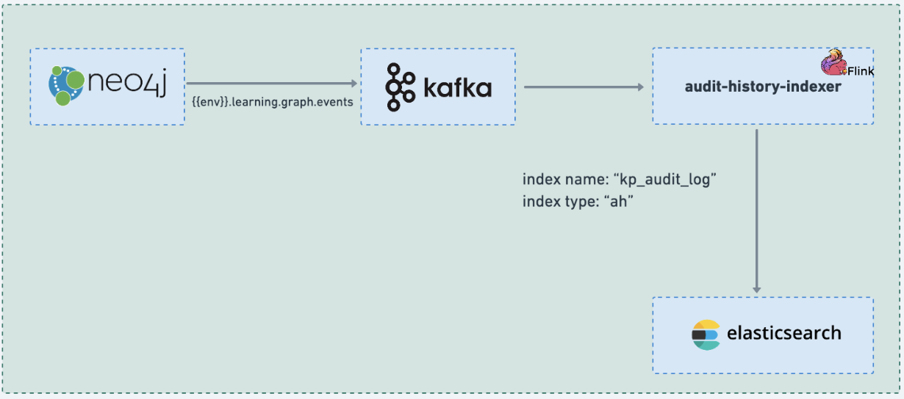

# Audit history indexer

### :stars: audit-history-indexer:

The job utilizes the neo4j mutation data to create an index of transactions for audit purposes. For each neo4j transaction, the job will audit the old and new values of the updated object. This audit trail helps track changes made to the data, allowing for historical analysis and ensuring data integrity and accountability.


<figure><figcaption><p>Audit history indexer job</p></figcaption></figure>

### Code:



### Configuration:

During the deployment process, the configuration for all knowledge-platform-jobs is sourced from the sunbird-learning-platform repository. On the other hand, for local setups, the configuration is taken from the respective job folders within the knowledge-platform-jobs repository.

**Kafka Topic:**

```
kafka {
      input.topic = "{{ env_name }}.learning.graph.events"
      groupId = "{{ env_name }}-audit-history-indexer-group"
    }
```

**Job configuration variables:**

<table><thead><tr><th width="227.3754826523833">Variable</th><th>Purpose</th></tr></thead><tbody><tr><td>timezone</td><td>Used to generate index name for the autit event to be indexed in ElasticSearch.<br><em>Default value:</em> "IST"</td></tr><tr><td></td><td></td></tr></tbody></table>

**Sample Kafka event:**

```
{
  "ets": 1649232292680,
  "channel": "01269878797503692810",
  "transactionData": {
    "properties": {
      "ownershipType": {
        "ov": null,
        "nv": [
          "createdBy"
        ]
      },
      "code": {
        "ov": null,
        "nv": "org.sunbird.cYmND2"
      },
      "credentials": {
        "ov": null,
        "nv": "{\"enabled\":\"Yes\"}"
      },
      "channel": {
        "ov": null,
        "nv": "01269878797503692810"
      },
      "description": {
        "ov": null,
        "nv": "Enter description for Course"
      },
      "organisation": {
        "ov": null,
        "nv": [
          "Tamil Nadu"
        ]
      },
      "language": {
        "ov": null,
        "nv": [
          "English"
        ]
      },
      "mimeType": {
        "ov": null,
        "nv": "application/vnd.ekstep.content-collection"
      },
      "idealScreenSize": {
        "ov": null,
        "nv": "normal"
      },
      "createdOn": {
        "ov": null,
        "nv": "2022-04-06T08:04:52.679+0000"
      },
      "primaryCategory": {
        "ov": null,
        "nv": "Course"
      },
      "contentDisposition": {
        "ov": null,
        "nv": "inline"
      },
      "lastUpdatedOn": {
        "ov": null,
        "nv": "2022-04-06T08:04:52.679+0000"
      },
      "contentEncoding": {
        "ov": null,
        "nv": "gzip"
      },
      "generateDIALCodes": {
        "ov": null,
        "nv": "No"
      },
      "dialcodeRequired": {
        "ov": null,
        "nv": "No"
      },
      "contentType": {
        "ov": null,
        "nv": "Course"
      },
      "trackable": {
        "ov": null,
        "nv": "{\"enabled\":\"Yes\",\"autoBatch\":\"No\"}"
      },
      "creator": {
        "ov": null,
        "nv": "Guest name changed"
      },
      "lastStatusChangedOn": {
        "ov": null,
        "nv": "2022-04-06T08:04:52.679+0000"
      },
      "audience": {
        "ov": null,
        "nv": [
          "Student"
        ]
      },
      "createdFor": {
        "ov": null,
        "nv": [
          "01269878797503692810"
        ]
      },
      "IL_SYS_NODE_TYPE": {
        "ov": null,
        "nv": "DATA_NODE"
      },
      "visibility": {
        "ov": null,
        "nv": "Default"
      },
      "os": {
        "ov": null,
        "nv": [
          "All"
        ]
      },
      "consumerId": {
        "ov": null,
        "nv": "cb069f8d-e4e1-46c5-831f-d4a83b323ada"
      },
      "targetFWIds": {
        "ov": null,
        "nv": [
          "tn_k-12_5"
        ]
      },
      "discussionForum": {
        "ov": null,
        "nv": "{\"enabled\":\"Yes\"}"
      },
      "mediaType": {
        "ov": null,
        "nv": "content"
      },
      "osId": {
        "ov": null,
        "nv": "org.ekstep.quiz.app"
      },
      "version": {
        "ov": null,
        "nv": 2
      },
      "versionKey": {
        "ov": null,
        "nv": "1649232292679"
      },
      "idealScreenDensity": {
        "ov": null,
        "nv": "hdpi"
      },
      "license": {
        "ov": null,
        "nv": "CC BY 4.0"
      },
      "createdBy": {
        "ov": null,
        "nv": "fca2925f-1eee-4654-9177-fece3fd6afc9"
      },
      "compatibilityLevel": {
        "ov": null,
        "nv": 1
      },
      "IL_FUNC_OBJECT_TYPE": {
        "ov": null,
        "nv": "Collection"
      },
      "userConsent": {
        "ov": null,
        "nv": "Yes"
      },
      "name": {
        "ov": null,
        "nv": "Untitled Course"
      },
      "IL_UNIQUE_ID": {
        "ov": null,
        "nv": "do_21351051094159360011743"
      },
      "status": {
        "ov": null,
        "nv": "Draft"
      },
      "resourceType": {
        "ov": null,
        "nv": "Course"
      }
    }
  },
  "mid": "eafe3ff1-c1bc-4a5c-85e6-c5b4c493cc69",
  "label": "Untitled Course",
  "nodeType": "DATA_NODE",
  "userId": "fca2925f-1eee-4654-9177-fece3fd6afc9",
  "createdOn": "2022-04-06T08:04:52.680+0000",
  "objectType": "Collection",
  "nodeUniqueId": "do_21351051094159360011743",
  "requestId": null,
  "operationType": "CREATE",
  "nodeGraphId": 1149047,
  "graphId": "domain"
}
```

