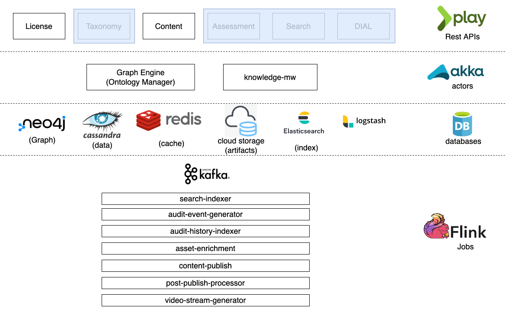
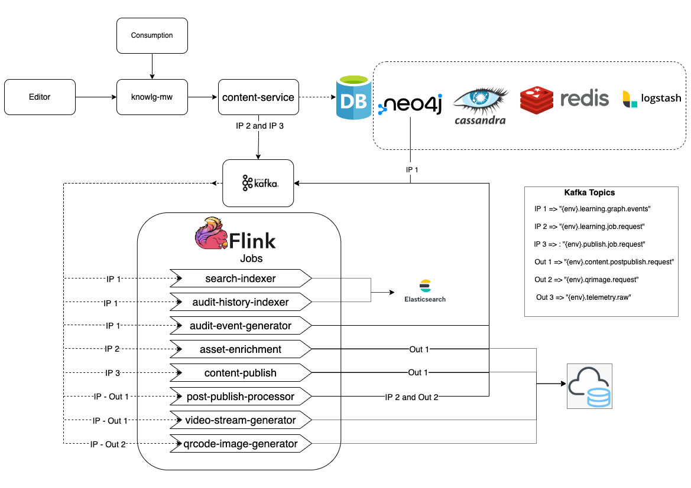

# Architecture

## Microservices

### Content-service:

Core service which is exposing all the asset & collection API's(REST API's).

### [License](https://documenter.getpostman.com/view/25463377/2s935hR7Ek#intro)

This is part of content-service but exposes the list of API's to do CRUD operations of License.&#x20;

## **Databases**

### **Neo4J**

This is used as a primary data store of the content-service & Taxonomy-service. The data of each asset is stored as a graph node. The data from this Neo4j DB will sync to Elasticsearch through flinkJob(search-Indxer) for ease of discovery.

### **Cassandra:**

This DB is used by content-service, Taxonomy-service & DIAL service. \
_Content-service:_ The asset data is stored in Neo4J. B the external/additional data of the asset will be stored in Cassandra because of large size data/information like Body, Collection hierarchy etc.\
_Taxonomy-service_: Object category definations are stored here. \
DIAL-service: We are using Cassadra as a primary store of DIAL data/information. This data will be synced to Elasticsearch through flinkJob(search-Indxer)

### **Redis:**

To improve the performance of API instead of hitting the DB for every Read call, we are using the Redis as temp cache.

## Flow-diagram

