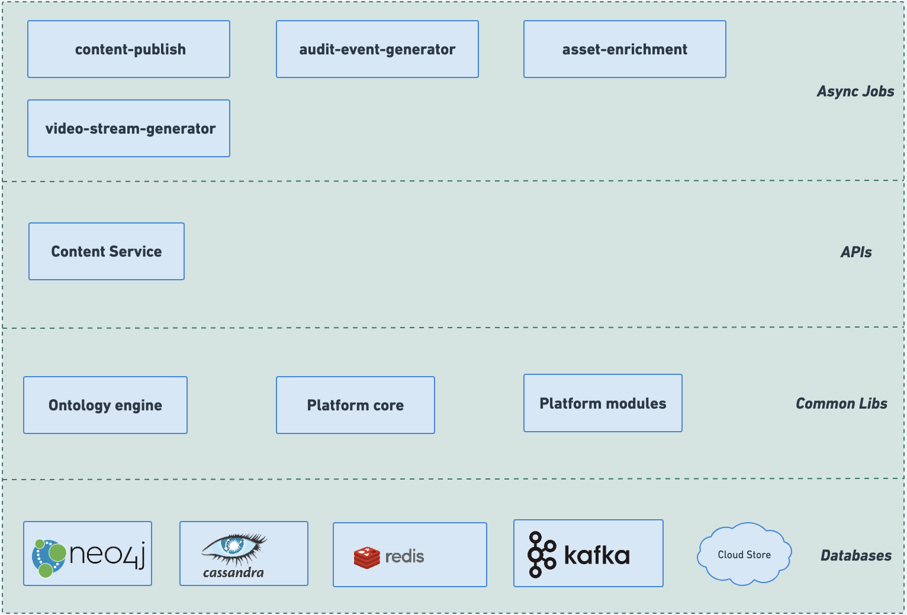

# Architecture

The below diagram represents the components involved and their arrangement in a **Content** service.

1. The **Content service** module has a play application and its internal actor module.&#x20;
2. **Neo4j** functions as the primary data store for the content-service. Within this Neo4j database, the data of each asset is stored as a graph node, allowing for efficient and interconnected data representation.
3. The asset data is primarily stored in Neo4J. However, due to the large size of external or additional data associated with the asset, such as the body of the asset, collection hierarchy, and other extensive information, this data is stored separately in **Cassandra**. By utilizing Cassandra to store this large-size data, the system can efficiently manage and retrieve asset-related information without overwhelming the Neo4J database. This approach ensures a scalable and optimized storage solution for assets, allowing Neo4J to focus on managing the core relationships and structure of the asset data, while Cassandra handles the storage of extensive asset-related information.
4. To enhance the API's performance and reduce the need for frequent database queries during Read calls, we have implemented **Redis** as a temporary cache. Redis serves as an in-memory data store that holds frequently accessed data. When a Read call is made to the API, the data is first checked in the Redis cache. If the data is found in Redis, the API can retrieve it directly from memory, avoiding the need to hit the database. This caching strategy significantly improves response times and reduces the load on the database, resulting in a more efficient and responsive API. Additionally, by using Redis as a cache, we can ensure that frequently requested data is readily available, further optimizing the overall performance of the API.
5. By leveraging **Flink**, we enable real-time and batch data processing with low latency, high throughput, and fault tolerance.

<figure><figcaption>
content-architecture
</figcaption></figure>

## Flow-diagram

<figure><figcaption>
content-service-flow-diagram
</figcaption></figure>

