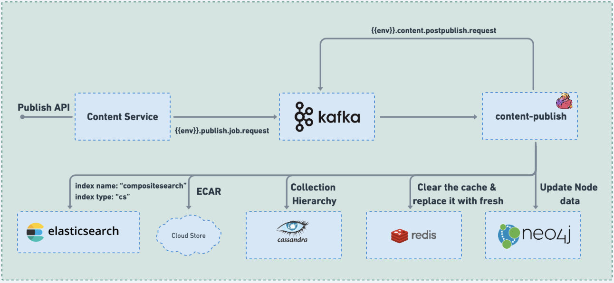

# Content publish

### :stars: Content-publish

The Job serves as a critical component for publishing content/collection objects submitted for publishing within the system. It fulfils various essential functions to ensure a seamless and efficient publishing process:

1. Download and ECAR Packaging: The Job is responsible for downloading media files and packaging them into ECAR (E-content Archive) format, enabling offline consumption of content.
2. Collection Hierarchy Publishing: It handles the publishing of updated or edited collection hierarchy data, ensuring that changes are correctly reflected in the published content.
3. Metadata Update: The Job updates the metadata of content/collection object nodes with essential publish information, including ECAR paths, versionKey, pkgVersion, streamingUrl, status, and other relevant details.
4. Elastic Search Indexing: For efficient search and retrieval, the Job indexes collection leaf node objects to Elastic Search, enabling streamlined access to content data.
5. Redis Cache Clearing: To maintain data integrity and consistency, the Job clears cached node data from Redis, ensuring that users always access up-to-date information.
6. Output Topics: The Job generates output topics for post-publish processing, video stream generation (if streaming is enabled and the content is of streamable mimeType)

By performing these essential functions, the Job plays a crucial role in ensuring the successful and accurate publishing of content/collection objects. It ensures that published content is properly packaged, metadata is updated, indexing is efficient, and caches are cleared for optimal user experience. Ultimately, the Job contributes to a robust and reliable publishing process within the system.

<figure><figcaption><p>content-publish</p></figcaption></figure>

### Code:



### Configuration:

During the deployment process, the configuration for all knowledge-platform-jobs is sourced from the sunbird-learning-platform repository. On the other hand, for local setups, the configuration is taken from the respective job folders within the knowledge-platform-jobs repository.

**Kafka Topic:**

```
kafka {
      input.topic = {{ env_name }}.publish.job.request
      groupId = {{ env_name }}-content-publish-group
}
```

**Job configuration variables:**

| Variable                              | Purpose                                                                                                                                                                                                                                                 |
| ------------------------------------- | ------------------------------------------------------------------------------------------------------------------------------------------------------------------------------------------------------------------------------------------------------- |
| content.bundleLocation                | <p>Used to specify local/server folder location where artifacts are to be downloaded for ECAR bundling.<br><em>Default value:</em> "/data/contentBundle/"</p>                                                                                           |
| content.isECARExtractionEnabled       | <p>Used to specify if the ECAR extraction is to be enabled to object 'version' and 'latest' cloud location using its 'snapshot' version.<br><em>Default value:</em> true</p>                                                                            |
| content.retry\_asset\_download\_count | <p>Used to specify number of times download attempt for assets part of content/collection object is to be done till it is successfully downloaded.<br><em>Default value:</em> 1</p>                                                                     |
| content.tmp\_file\_location           | NOT USED                                                                                                                                                                                                                                                |
| content.objectType                    | <p>Used to specify list of valid objectTypes supported for publishing.<br><em>Default value:</em> ["Content", "ContentImage"]</p>                                                                                                                       |
| content.mimeType                      | <p>Used to specify list of valid mimeTypes supported for publishing.<br><em>Default value:</em> ["application/pdf"]</p>                                                                                                                                 |
| content.asset\_download\_duration     | <p>Used to specify time in seconds to wait for the asset download request to respond.<br><em>Default value:</em> "60 seconds"</p>                                                                                                                       |
| content.stream.enabled                | <p>Used to check if streaming is enabled for published objects. If it is enabled, content rendenring is done using 'streamingUrl' attribute else via 'artifactUrl'<br><em>Default value:</em> false</p>                                                 |
| content.stream.mimeType               | <p>Used to check if the mimeType of the object being published is of streamable type. If yes,  event for video-stream-generator job is generated.<br><em>Default value:</em> ["video/mp4"]</p>                                                          |
| content.artifact.size.for\_online     | <p>Used to set the maximum size of the object (in bytes) that can be played by downloading beyond which "contentDisposition" is set to "online-only". <br><em>Default value:</em> 209715200</p>                                                         |
| content.downloadFiles.spine           | <p>Used to specify list of attributes that store asset Urls which are to be downloaded from the mentioned Urls while packaging SPINE ECAR.  <br><em>Default value:</em> ["appIcon"]</p>                                                                 |
| content.downloadFiles.full            | <p>Used to specify list of attributes that store asset Urls which are to be downloaded from the mentioned Urls while packaging FULL ECAR.  <br><em>Default value:</em> ["appIcon", "grayScaleAppIcon", "artifactUrl", "itemSetPreviewUrl", "media"]</p> |
| content.nested.fields                 | <p>Used to specify the list of object properties that are of object types with nested attributes.<br><em>Default value:</em> ["badgeAssertions","targets","badgeAssociations"]</p>                                                                      |
| cloud\_storage.folder.content         | <p>Used to specify the cloud store container folder name for content file storage/extraction etc.<br><em>Default value:</em> "container"</p>                                                                                                            |
| cloud\_storage.folder.artifact        | <p>Used to specify the cloud store container folder name for artifact (media) files storage.<br><em>Default value:</em> "artifact"</p>                                                                                                                  |
| contentTypeToPrimaryCategory          | <p>Used to specify the mapping between contentType and primaryCategory attributes using which object metadata is populated with the missing attribute among two.<br><em>Default value:</em> []</p>                                                      |
| compositesearch.index.name            | <p>Used to specify the composite search index name where collection object nodes are synced with updated metadata.<br><em>Default value:</em> "compositesearch"</p>                                                                                     |
| search.document.type                  | <p>Used to specify the ElasticSearch document index type using which collection object nodes are synced with updated metadata.<br><em>Default value:</em> "cs"</p>                                                                                      |
| master.category.validation.enabled    | <p>Used to specify whether object getting published is to be enriched with framework metadata.<br><em>Default value:</em> "Yes"</p>                                                                                                                     |
| service.print.basePath                | NOT USED                                                                                                                                                                                                                                                |
| mimetype.allowed\_extensions.word     | <p>Used to specify the list of file extensions allowed for uploaded content object. <br><em>Default value:</em> ["doc", "docx", "ppt", "pptx", "key", "odp", "pps", "odt", "wpd", "wps", "wks"]</p>                                                     |
| enableDIALContextUpdate               | Used to sepcify if the DIAL code context update data is to be computed using the linked/de-linked Dial codes of the content/collection.                                                                                                                 |

**Sample Kafka event:**

```
{
  "eid": "BE_JOB_REQUEST",
  "ets": 1619527882745,
  "mid": "LP.1619527882745.32dc378a-430f-49f6-83b5-bd73b767ad36",
  "actor": {
    "id": "content-publish",
    "type": "System"
  },
  "context": {
    "channel": "01309282781705830427",
    "pdata": {
      "id": "org.sunbird.platform",
      "ver": "1.0"
    },
    "env": "dev"
  },
  "object": {
    "id": "do_11329603741667328018",
    "ver": "1619153418829"
  },
  "edata": {
    "publish_type": "public",
    "metadata": {
      "identifier": "do_11329603741667328018",
      "mimeType": "application/pdf",
      "objectType": "Content",
      "lastPublishedBy": "",
      "pkgVersion": 1
    },
    "action": "publish",
    "iteration": 1
  }
}
```


_<mark style="color:blue;">**Dependency:**</mark>_&#x20;

**Services:** Content Service - composite search API

**Jobs:** 'post-publish-processor', 'video-stream-generator' & 'mvc-indexer'&#x20;

