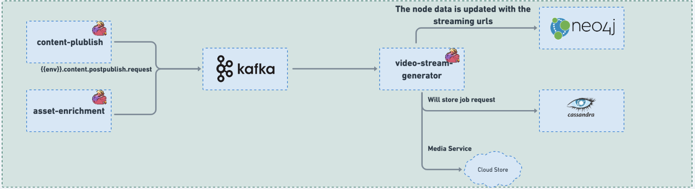

# Video stream generator

### :stars: video-stream-generator:

The Job serves the purpose of generating streaming media for the uploaded video contents that have MIME types of MP4 and WebM. This streaming media generation process enables users to efficiently stream and access video content without the need to download the entire video file.

The Job takes the uploaded video files with MP4 and WebM MIME types and processes them to create streaming-friendly versions. These versions are optimized for streaming, allowing users to view the video content in real-time as it is delivered over the internet. By enabling streaming, the Job enhances user experience, reducing buffering time and providing seamless access to video content.

The generated streaming media can be consumed through various streaming services and players, enabling users to access the video content on different devices and platforms without any interruptions. This capability significantly improves the accessibility and usability of the uploaded video contents, making it easier for users to enjoy and interact with the media.


<figure><figcaption><p>video-stream-generator</p></figcaption></figure>

### Code:



### Configuration:

During the deployment process, the configuration for all knowledge-platform-jobs is sourced from the sunbird-learning-platform repository. On the other hand, for local setups, the configuration is taken from the respective job folders within the knowledge-platform-jobs repository.

**Kafka Topic:**

```
kafka {
      input.topic = "{{ env_name }}.content.postpublish.request"
      groupId = "{{ env_name }}-video-stream-generator-group"
    }
```

**Job configuration variables:**

| Variable                 | Purpose                                                                                                                              |
| ------------------------ | ------------------------------------------------------------------------------------------------------------------------------------ |
| service.content.basePath | Used to configure Content Service API base path for accessing System Update API (/content/v4/system/update/ - not exposed publicly). |

**Sample Kafka event:**

```
{
  "eid": "BE_JOB_REQUEST",
  "ets": 1649174914686,
  "mid": "LP.1649174914686.02c7ac3d-f7b2-46be-9771-e91645ecd632",
  "actor": {
    "id": "Post Publish Processor",
    "type": "System"
  },
  "context": {
    "pdata": {
      "ver": "1.0",
      "id": "org.sunbird.platform"
    },
    "channel": "01272777697873100812",
    "env": "sunbirdstaging"
  },
  "object": {
    "ver": "1649169311270",
    "id": "do_21350999440018636811684"
  },
  "edata": {
    "action": "post-publish-process",
    "iteration": 1,
    "identifier": "do_21350999440018636811684",
    "channel": "01272777697873100812",
    "mimeType": "application/vnd.ekstep.content-collection",
    "contentType": "Course",
    "pkgVersion": 1,
    "status": "Live",
    "name": "CourseMElenor",
    "trackable": {
      "enabled": "Yes",
      "autoBatch": "No"
    }
  }
}
```


_<mark style="color:blue;">**Dependency:**</mark>_** Services:** Content Service - system update API

