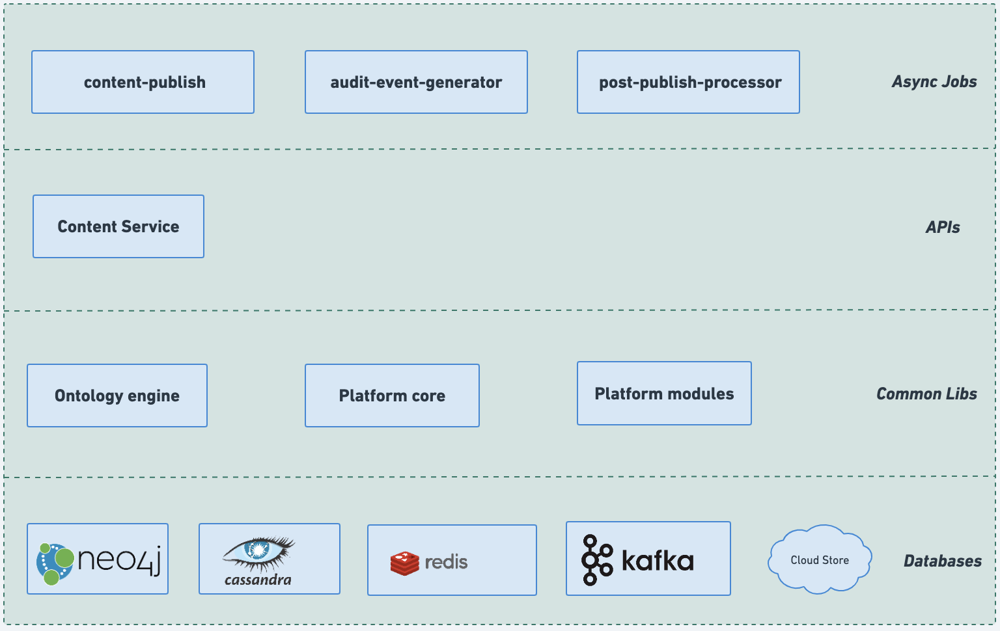
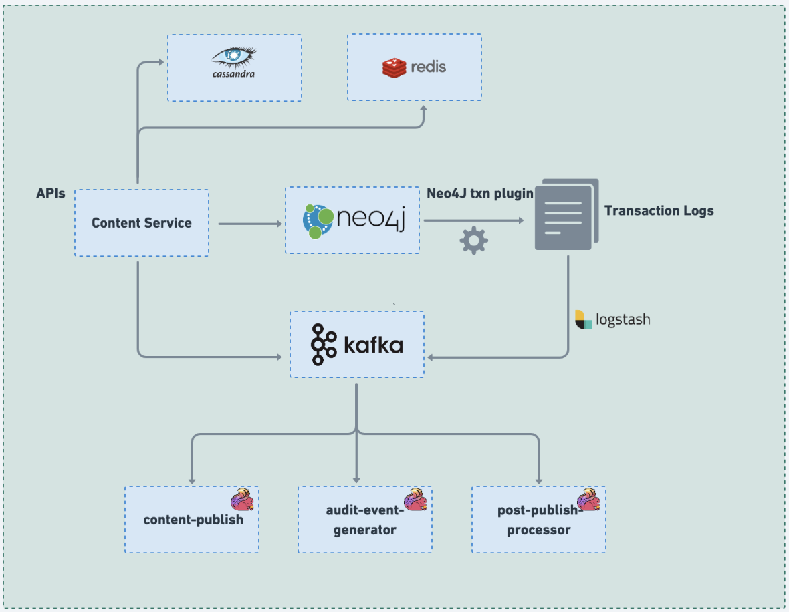

# Architecture

The below diagram represents the components involved and their arrangement in a Content service to Serve **Collection APIs**

<figure><figcaption>
collection-architecture
</figcaption></figure>

## Flow-diagram

<figure><figcaption></figcaption></figure>

