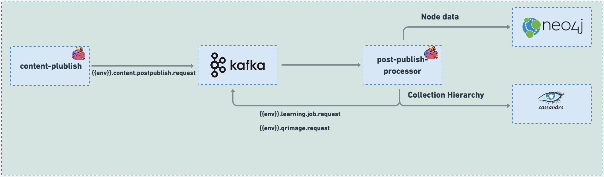

# Post publish processor

### :stars: post-publish-processor:

The Job plays a crucial role in triggering post-publish activities, specifically when a collection is published. Some of these post-publish activities include:

1. Shallow Copy: In the case of shallow copy type collections, the Job republishes the hierarchy information when an origin collection is published. This ensures that the hierarchy is correctly updated, reflecting changes made during the publishing process.
2. Default DIAL Code Generation: For a 'Course' collection primaryCategory object, the Job takes care of reserving a DIAL Code and generating QR Code images for the reserved DIAL code by default. This ensures that each 'Course' object is uniquely identified with a DIAL Code and that QR Code images are available for easy access and scanning.
3. Course Batch Creation: Based on the 'traceability' configuration, the Job triggers the automatic creation of course batches for 'Course' primaryCategory objects if there are no running batches already existing. This automated batch creation simplifies the process of managing course enrolments and ensures efficient course administration.
4. DIAL Code Context Update: Upon publishing a collection/content, the Job initiates individual context update events for newly added DIAL codes and removes DIAL codes associated with the published collection/content. This ensures that the DIAL code context is consistently updated to reflect the changes made during the publishing process.

In summary, the Job's post-publish activities encompass a range of crucial tasks, from updating hierarchy information and generating default DIAL codes to creating course batches and managing DIAL code context updates. These activities collectively contribute to a seamless and efficient post-publish workflow, ensuring accurate and consistent data handling throughout the publishing process.

<figure><figcaption></figcaption></figure>

### Code:



### Configuration:

During the deployment process, the configuration for all knowledge-platform-jobs is sourced from the sunbird-learning-platform repository. On the other hand, for local setups, the configuration is taken from the respective job folders within the knowledge-platform-jobs repository.

**Kafka Topic:**

```
kafka {
      input.topic = {{ env_name }}.content.postpublish.request
      groupId = {{ env_name }}-post-publish-processor-group
      
      publish.topic = {{ env_name }}.publish.job.request
      qrimage.topic = {{ env_name }}.qrimage.request
      dialcode.context.topic = {{ env_name }}.dialcode.context.job.request
    }
```

**Job configuration variables:**

No job functionality specific variables to list.

**Sample Kafka event:**

```
{
  "eid": "BE_JOB_REQUEST",
  "ets": 1649170015935,
  "mid": "LP.1649170015935.2a7382ff-8bc9-4ff5-8620-2d467cf8990a",
  "actor": {
    "id": "Post Publish Processor",
    "type": "System"
  },
  "context": {
    "pdata": {
      "ver": "1.0",
      "id": "org.sunbird.platform"
    },
    "channel": "01272777697873100812",
    "env": "sunbirdstaging"
  },
  "object": {
    "ver": "1649169952265",
    "id": "do_21350999965318348811690"
  },
  "edata": {
    "action": "post-publish-process",
    "iteration": 1,
    "identifier": "do_21350999965318348811690",
    "channel": "01272777697873100812",
    "mimeType": "application/vnd.ekstep.content-collection",
    "contentType": "Course",
    "pkgVersion": 1,
    "status": "Live",
    "name": "CourseMTimmothy",
    "trackable": {
      "enabled": "Yes",
      "autoBatch": "No"
    }
  }
}
```


_<mark style="color:blue;">**Dependency:**</mark>_ \
1\. **Kafka** **Jobs:** 'qrcode-image-generator', 'content-publish' (For Shallow Copy Collections publishing)

2\. **Services:** Asset Search Service **(**[Search API](https://documenter.getpostman.com/view/25463377/2s8ZDa3MP7)), LMS Service ([Course Batch Create](https://lern.sunbird.org/learn/product-and-developer-guide/batch-service/api-documentation#api-documentation)), Learning Service to reserve DIAL codes for a collection.

