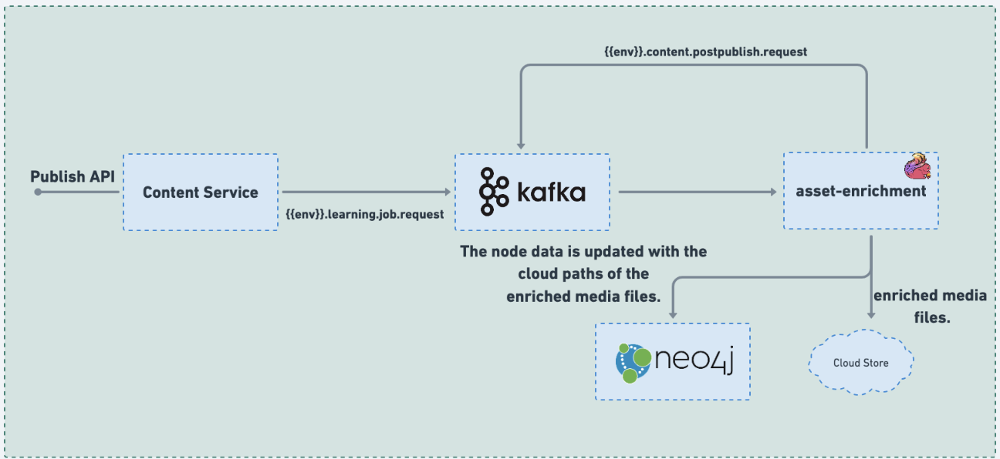

# Asset enrichment

###

### :stars: asset-enrichment:

The Job is responsible for managing image and video media files that are associated with uploaded or created content. Whenever an asset or media file is uploaded as part of the content, a corresponding event is generated and inserted into Kafka, which then triggers the 'asset-enrichment' job.

For image media files, the Job performs image enrichment by resizing the images to achieve an optimal DPI (dots per inch). Additionally, three different image variants are generated, each with low, medium, and high resolutions. These variants are then stored in the cloud, making them readily available for different use cases and devices.

Regarding video media files, the Job handles video enrichment, which includes fetching video metadata and generating a thumbnail for the video. Furthermore, it triggers the 'video-stream-generator' job, which is responsible for creating a streamable source for the video. This streamable source allows users to efficiently stream and access the video content.

Overall, the Job plays a crucial role in enhancing the content by enriching the associated image and video media files. The image enrichment process ensures optimal resizing and the availability of multiple resolution variants, while the video enrichment process provides valuable features such as video metadata, thumbnails, and streamable sources, contributing to an improved user experience and content accessibility.

<figure><figcaption><p>asset-enrichment</p></figcaption></figure>

### Code:



### Configuration:

During the deployment process, the configuration for all knowledge-platform-jobs is sourced from the sunbird-learning-platform repository. On the other hand, for local setups, the configuration is taken from the respective job folders within the knowledge-platform-jobs repository.

**Kafka Topic:**

```
kafka { 
    input.topic = {{ env_name }}.learning.job.request 
    groupId = {{ env_name }}-asset-enrichment-group 
}
```

**Job configuration variables:**

| Variable                        | Purpose                                                                                                                                                                                                                       |
| ------------------------------- | ----------------------------------------------------------------------------------------------------------------------------------------------------------------------------------------------------------------------------- |
| content.stream.enabled          | <p>Used to enable or disable video stream generation for the uploaded video asset.</p><p><em>Default value:</em> false</p>                                                                                                    |
| content.strem.mimeType          | <p>Used to identify streamable mimeTypes.</p><p><em>Default value:</em> ["video/mp4"]</p>                                                                                                                                     |
| content.youtube.applicationName | <p>Used as credential for youtube client creation in YouTubeUtil.scala file. <br><em>Default value:</em> "fetch-youtube-license"</p>                                                                                          |
| content.youtube.regexPattern    | <p>Used to extract youtube media Id by identifying youtube url pattern using regex.</p><p><em>Default value:</em> ["\?vi?=([^&#x26;]<em>)", "watch\?.v=([^&#x26;])", "(?:embed|vi?)/([^/?]</em>)", "^([A-Za-z0-9\-\_]*)"]</p> |
| content.upload.context.driven   | _Default value:_ true                                                                                                                                                                                                         |
| content.max.iteration.count     | <p>Used to indicate number of times the event is to be attempted for publishing till it is processed successfully. </p><p><em>Default value:</em> 2</p>                                                                       |
| thumbnail.max.sample            | _Default value:_ 5                                                                                                                                                                                                            |
| thumbnail.max.size.pixel        | D_efault value:_ 150                                                                                                                                                                                                          |

**Sample Kafka event:**

```
{
  "eid": "BE_JOB_REQUEST",
  "ets": 1648720639981,
  "mid": "LP.1648720639981.d6b1d8c8-7a4a-483a-b83a-b752bede648c",
  "actor": {
    "id": "Asset Enrichment Samza Job",
    "type": "System"
  },
  "context": {
    "pdata": {
      "ver": "1.0",
      "id": "org.sunbird.platform"
    },
    "channel": "01269878797503692810",
    "env": "staging"
  },
  "object": {
    "ver": "1648720639904",
    "id": "do_2135063194770636801334"
  },
  "edata": {
    "action": "assetenrichment",
    "iteration": 1,
    "mediaType": "image",
    "status": "Processing",
    "objectType": "Asset"
  }
}
```


_<mark style="color:blue;">**Dependency:**</mark>_** Jobs:** 'video-stream-generator' .\
**External Software:** imagemagick

