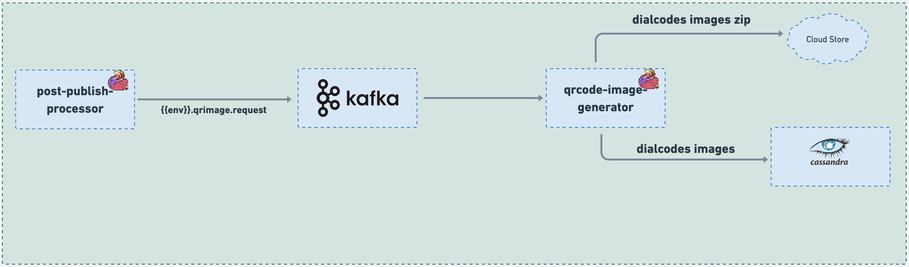

# Jobs

### :stars: qrcode-image-generator:

The Job is utilized for the purpose of generating QR Code images specifically for the reserved DIAL codes of a collection. This generation process is initiated using the process Id that is generated when the DIAL code reserve API is invoked.

Once the DIAL codes are reserved for the collection, the Job comes into action, leveraging the associated process Id to create QR Code images. These QR Code images are then linked to the respective reserved DIAL codes, providing a quick and accessible method for identifying and accessing the collection.

By employing the Job in this manner, the platform ensures that each reserved DIAL code is visually represented through QR Code images, facilitating ease of use and enhancing the collection's traceability and accessibility. This process enables users to conveniently scan the QR Code to obtain information and interact with the associated collection, promoting seamless user experiences and efficient content management within the platform.

<figure><figcaption><p>qrcode-image-generator</p></figcaption></figure>

### Code:



### Configuration:

During the deployment process, the configuration for all knowledge-platform-jobs is sourced from the sunbird-learning-platform repository. On the other hand, for local setups, the configuration is taken from the respective job folders within the knowledge-platform-jobs repository.

**Kafka Topic:**

```
kafka {
      input.topic = "{{ env_name }}.qrimage.request"
      groupId = "{{ env_name }}-qrcode-image-generator-group"
    }
```

**Job configuration variables:**

| Variable              | Purpose                                                                                                                   |
| --------------------- | ------------------------------------------------------------------------------------------------------------------------- |
| lp.tmp.file.location  | <p>Used to specify machine directory where the qrcode images are to be packaged at.<br><em>Default value:</em> "/tmp"</p> |
| qr.image.imageFormat  | <p>Used to specify qrcode image file format (Example: png)<br><em>Default value:</em> "png"</p>                           |
| qr.image.bottomMargin | <p>Used to specify qrcode image bottom margin.<br><em>Default value:</em> 0</p>                                           |
| qr.image.margin       | <p>Used to specify qrcode image margin.<br><em>Default value:</em> 1</p>                                                  |

**Sample Kafka event:**

```
{
  "eid": "BE_QR_IMAGE_GENERATOR",
  "processId": "3b369c35-2b79-40ec-a3e0-3d0306fc0388",
  "objectId":"contentid/channel",
  "dialcodes": [
    {
      "data": "https://diksha.gov.in/dial/ABCDEF",
      "text": "ABCDEF",
      "id": "ABCDEF_1543568148",
      "location":"cloudPublicUrl"
    },
    {
      "data": "https://diksha.gov.in/dial/123456",
      "text": "123456",
      "id": "123456_1543568148"
    }
  ],
  "storage": {
    "container": "dial",
    "path": "channel/publisher/",
    "fileName": "do_112636984058314752121_Medium_Grade_Subject_timestamp"
  },
  "config": {
    "errorCorrectionLevel": "H",
    "pixelsPerBlock": 2,
    "qrCodeMargin": 3,
    "qrCodeMarginBottom": 1,
    "textFontName": "Verdana",
    "textFontSize": 11,
    "textCharacterSpacing": 0.1,
    "imageFormat": "png",
    "colourModel": "Grayscale",
    "imageBorderSize": 1,
    "imageMargin": 1

```
