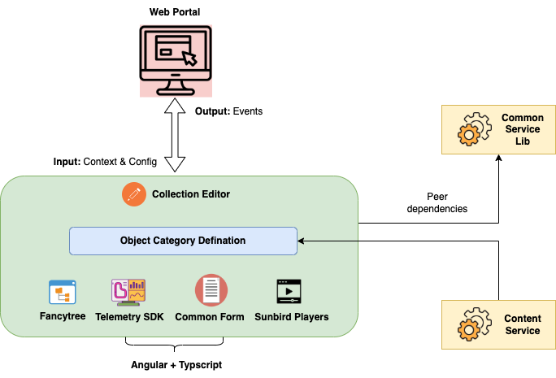

# Architecture

[<mark style="color:blue;">**Fancytree**</mark>](https://github.com/mar10/fancytree/wiki)\
The main purpose of using a fancy tree is to organize your assets in a multi-level hierarchy

[**Sunbird Players**](../../player/v1/players/)\
The sunbird players are used to preview linked assets such as PDF, Video, EPUB, etc.

[**Common Form (SB-Form)**](https://ed.sunbird.org/use/learn-more/specifications/sunbirded-forms)\
Use Common Forms to define the dynamic layout of a page that contains fields and sections. What makes this dynamic is that you can show/hide the sections & fields based on certain criteria, which is not possible with static page layouts.

[**Telemetry SDK**](https://telemetry.sunbird.org/)\
This is used for generating the telemetry from the editor as a utility dependency library.

<mark style="color:purple;">**Common Service Lib**</mark>\
This is used to send the telemetry to the server.
