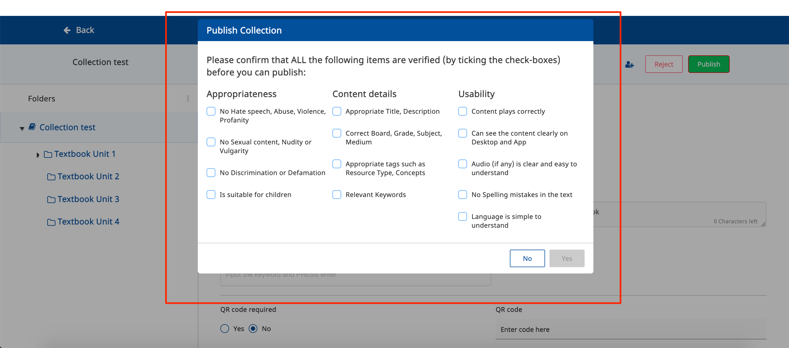

# Features

<details>

<summary>Mode</summary>

The editor can be set into a read-only mode simply by changing the value of the Config#mode property. \
\
Following are types of mode:\
1\.  read\
2\. edit\
3\. review\
\
**- read**\
****The read mode is a feature within the editor that allows users to see the editor. But you cannot edit it.\
Here’s the configuration:

```
"config": {
   mode: 'read',
}
```

.png>)\
In the above screenshot, you can see all the contents but can not perform any actions on the editor.\
****\
**- edit**\
****All the fields will be enabled to edit for the collection creator.\
Here’s the configuration:

```
"config": {
   mode: 'edit',
}
```

****\
****.png>)****\
****\
**- review**\
****It’s similar to read mode only. but here users can perform some actions such as publish, reject. \
Here’s the configuration:

```
"config": {  
    mode: 'review',
}
```

&#x20; \
\
But here you define which fields of a form can be editable for a specific `mode` with limited editing rights, leaving the rest of the fields non-editable to them. \
\
\- **editableFields**\
Its object for different types of mode based on which some fields get enabled.\
Here is the sample configuration for review mode:

```
"config": {  
    mode: 'review',
    editableFields: {
        "review": ["title" ]
    }
}
```

\
(Note: In the above case `editableFields.review: ['title']` so only the instruction field is enabled for reviewer while reviewing the collection)

</details>

<details>

<summary>Asset Config</summary>

Asset Config sets the max size limit for images to be uploaded in the collection editor and the type of images.\
Here is the configuration:

```
"config": {  
    assetConfig: {
        "image": {
            "size": 1,
            "sizeType": "MB",
            "accepted": "png, jpeg"
        }
    }
}
```

.png>)

</details>

<details>

<summary>Organize collection TOC</summary>

The maximum number of levels in the collection has to be defined using the `maxDepth` property. This has to be updated in the object metadata of the primary category definition under hierarchy.\
`maxDepth` defines the level of collection i.e at which level content is to be linked. If `maxDepth` is set as 0, `Add from library` button gets enabled at the root node.

```
"config": {
  children: {  
    "Content": [
      "Explanation Content",
      "Learning Resource",
      "eTextbook",
      "Teacher Resource",
      "Course Assessment"
    ],
    "QuestionSet": [
        "Practice Question Set"
      ]
    }
  }
}
```

If the `maxDepth` is set as 1, we need to define `hierarchy` object also.\
Here is the default value of hierarchy we are using, you can change the name of level and children also.\
Here is the configuration:

```
"config": {  
  "hierarchy": {
      "level1": {
        "name": "Textbook Unit",
        "type": "Unit",
        "mimeType": "application/vnd.ekstep.content-collection",
        "contentType": "TextBookUnit",
        "primaryCategory": "Textbook Unit",
        "iconClass": "fa fa-folder-o",
        "children": {
          "Content": [
            "Explanation Content",
            "Learning Resource",
            "eTextbook",
            "Teacher Resource",
            "Course Assessment"
          ],
          "QuestionSet": []
        }
      }
   }
}
```

_**(Note: If you add more depth you need to add more levels in the hierarchy.)**_\
.png>)\


</details>

<details>

<summary>Collaboration</summary>

When "showAddCollaborator" is set it to `true` it enables the add collaborator option in the collection editor. With which creator can as select the collaborate to contribute to the same collection.\
Here is the configuration:

```
"config": {  
    showAddCollaborator: true,
}
```

.png>)

</details>

<details>

<summary><strong>Max contents limit</strong></summary>

This defines the maximum number of content to be created in a collection.\
Here is the configuration:

```
"config": {  
    collection: {
      maxContentsLimit: 8,
    }
}
```

Suppose if `maxContentsLimit` is set to **“8“** then while trying to add new content from `Add from library` it will give an error maxlimit message as:\
\*\*\*\*

</details>

<details>

<summary><strong>Content policy URL</strong></summary>

It defines where should the content policy link should be redirected. This popup will get appear on click of `submit for review` button.\
Here is the configuration:

```
"config": {  
    contentPolicyUrl: "/term-of-use.html"
}
```

.png>)

</details>

<details>

<summary>Generate/Link <strong>DIALCodes</strong></summary>

When "generateDIALCodes" is set to `yes` it enables the add dialcode option in the collection editor. With which the creator can generate and link to the same collection.\
`generateDIALCodes: yes/no`

.png>)\
\
Following are the validations for generateDIALCodes\*\*:\*\*\
\*\*\*\*\
**1.** **dialcodeMaxLength**\
The `dialcodeMaxLength` defines the maximum number of dial-codes to be generated. This value must be less than or equal to the value of the `dialcodeMaxLength`\
`otherwise, it'll throw an error message as:\` \
The default value is `250`\
\
**2**.**dialcodeMinLength**\
\*\*\*\*The `dialcodeMinLength` defines the minimum number of dial-codes to be generated. This value must be greater than or equal to the value of the `dialcodeMinLength`\
\`\`otherwise, it'll throw an error message as:\
.png>)\
The default value is `2`

</details>

<details>

<summary>icon</summary>

This defines the icon which comes in the node and levels, you can set your own icon here by adding the class of icon, in the root node for `iconClass: 'fa fa-book'` an icon is shown as:\
.png>)

</details>

<details>

<summary>Add from library</summary>

This feature allows us to link content to any unit/level of the collection.\
Here's the sample configuration:

```
config: {
      mode: 'edit',
      maxDepth: 2,
      objectType: 'Collection',
      primaryCategory: 'Digital Textbook',
      isRoot: true,
      iconClass: 'fa fa-book',
      children: {},
      hierarchy: {
          level1: {
              name: 'Textbook Unit',
              type: 'Unit',
              mimeType: 'application/vnd.ekstep.content-collection',
              contentType: 'TextBookUnit',
              primaryCategory: 'Textbook Unit',
              iconClass: 'fa fa-folder-o',
              children: {
                Content: [
                  'Explanation Content',
                  'Learning Resource',
                  'eTextbook',
                  'Teacher Resource',
                  'Course Assessment'
                ]
              }
          },
          level2: {
              name: 'Textbook Unit',
              type: 'Unit',
              mimeType: 'application/vnd.ekstep.content-collection',
              contentType: 'TextBookUnit',
              primaryCategory: 'Textbook Unit',
              iconClass: 'fa fa-folder-o',
              children: {
                Content: [
                  'Explanation Content',
                  'Learning Resource',
                  'eTextbook',
                  'Teacher Resource',
                  'Course Assessment'
                ]
              }
          }
      }
  }
```

.png>).png>).png>)

By using this configuration, you can also filter specific contents in the add form library page.

```
children: {
  Content: [
   'Explanation Content',
   'Learning Resource',
   'eTextbook',
   'Teacher Resource',
   'Course Assessment'
  ]
 }
```

\
Here is the screenshot:\
.png>)

</details>
