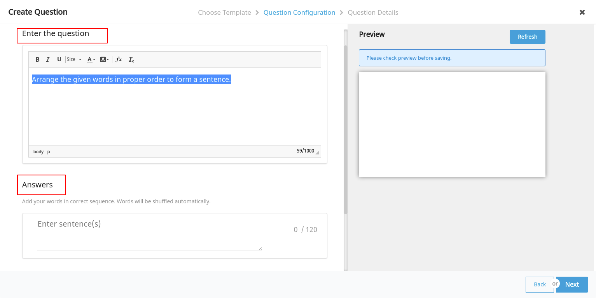
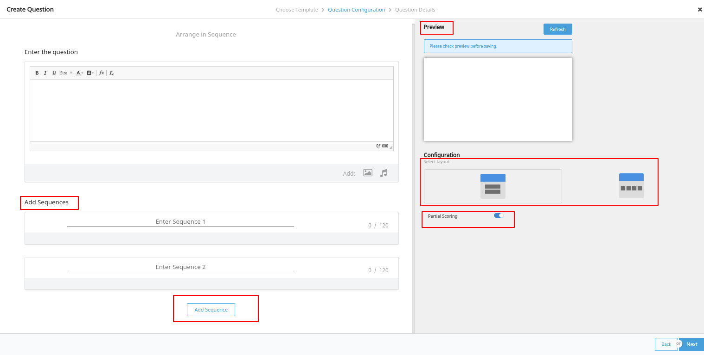

# Features

Features are listed out in this [sunbird developer documents](sunbird-developer-documents.md). Please refer for more information.

## Quiz

Please refer [adding question set ](http://docs.sunbird.org/1.8/features-documentation/questionset\_create/)in sunbird developer documents to how to add the question set

**The following types of quiz can be create in interactive editor**

* [MTF](./#mtf)
* [MCQ](./#mcq)
* [FTB](./#ftb)
* [Reordering words](./#reordering-words)
* [Arrange in Sequence](./#arrange-in-sequence)

### MTF

MTF Template is used to create the Match the following type questions. Please refer [Creating Fill in the Blanks Question](http://docs.sunbird.org/1.8/features-documentation/questionset\_create/#creating-questions) section in sunbird doc

### MCQ

MCQ Template is used to create the Multiple choice type questions. Please refer [Creating Multiple Choice Question ](http://docs.sunbird.org/1.8/features-documentation/questionset\_create/#creating-questions)section in sunbird doc

Mcq has the different types of layouts which can be used to create the multiple choice questions

### FTB

By using this template you can create the Fill in the blank type questions. Please refer [Creating Fill in the Blanks Question](http://docs.sunbird.org/1.8/features-documentation/questionset\_create/#creating-questions) section in sunbird doc

### Reordering words

To arrange the given words in proper order to form a sentence use this reordering words templates.

### Arrange in Sequence

You can create the questions like, you want to arrange the sentences in correct sequence. This also supports the different types of layouts and partial scoring.

## Plugins

#### **Following plugins are used to create and view the quiz using interactive editor**

* Question unit : This plugin is responsible to load the different types of questions and templates
* Question set: Question set plugin is responsible to create and save the different types of question sets and questions
* Mcq : Using mcq plugin, you can create and render the multiple choice questions
* FTB : FTB plugins creates and loads fill in the blanks types questions
* MTF : Match the following type questions can be created in this plugin
* Reorder : By using this plugin, you can create and render the reordering type questions
* Question bank: Question bank plugin is responsible to create and load the questions.
* Preview : Preview plugin is taking care of rendering the different types of questions in question bank view - where user can see the immediate preview after creating the questions

## Configurations

Please refer [Configuring Questions](http://docs.sunbird.org/1.8/features-documentation/questionset\_create/#configuring-questions) section in sunbird developer documents to how to add the question set

###
