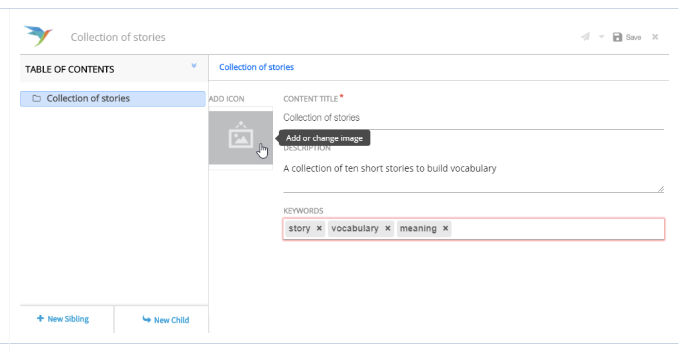

# Add Image

To add images to metadata

### Steps

#### Click the **Image**

Click the **Image** icon to add an image

<figure><figcaption></figcaption></figure>

#### &#x20;Add images

a) Selecting an image from the inbuilt list  

\
b) Uploading images from your local machine

1. Click **My images** to view a list of all image files that you have previously, uploaded
2. Click **All image** to view a list of image files from the repository \
   **Note**: The repository contains all image files added and uploaded by any users
3. Choose an appropriate image file from any list and click **Select**
4. Click Upload and use to **upload and use** images from your gallery

<figure><figcaption></figcaption></figure>

#### Upload and use

1. Click **Choose File** to browse and select a file from your local drive or open the explorer in a separate window or **drag and drop** the required file \
   **Note**: Supported file formats are: .jpeg, .jpg, .png
2. Under **Copyright and License**, select if you want to:  \
   a) Make it available to everyone  \
   b) Not share with anyone
3. Add image details in the **Asset Caption** area. Details such as, Tags, Details, Creator are optional
4. Click **Upload** and Use to upload the image

<figure><figcaption></figcaption></figure>

