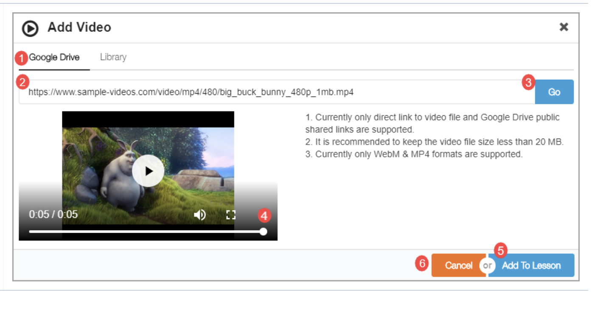
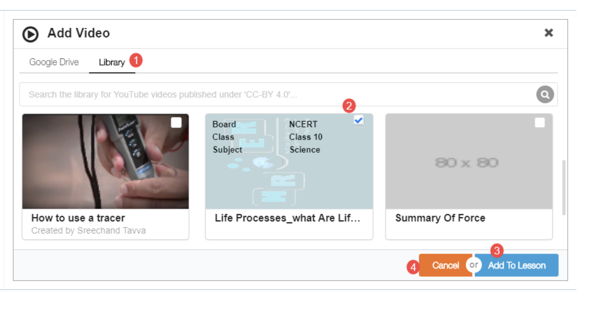

# Add Video

#### Adding Online Videos 

1. Select the **Google Drive** tab to add videos from your Google Drive, Youtube channel, or a direct URL of an mp4 video
2. Paste the copied video URL in the text box
3. Click Go to search the video
4. The video is displayed in the **Preview** pane
5. Click **Add to Lesson** to add video in the content editor
6. Click **Cancel** to exit

<figure><figcaption></figcaption></figure>

#### Adding Video Details 

1. Select the **Library** tab to add videos from your device
2. Browse and select the video from the available list
3. Click **Add to Lesson** to add video in the content editor
4. Click **Cancel** to exit

<figure><figcaption></figcaption></figure>
