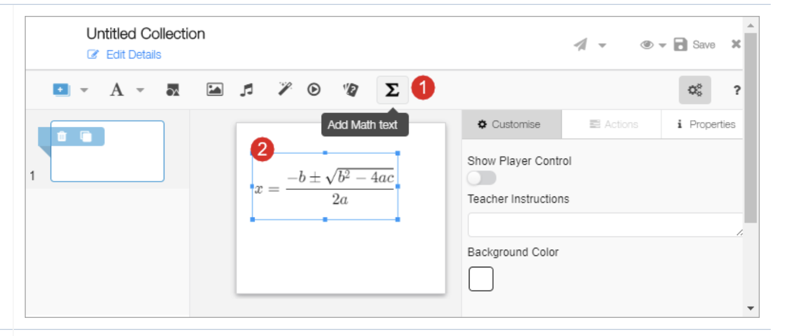
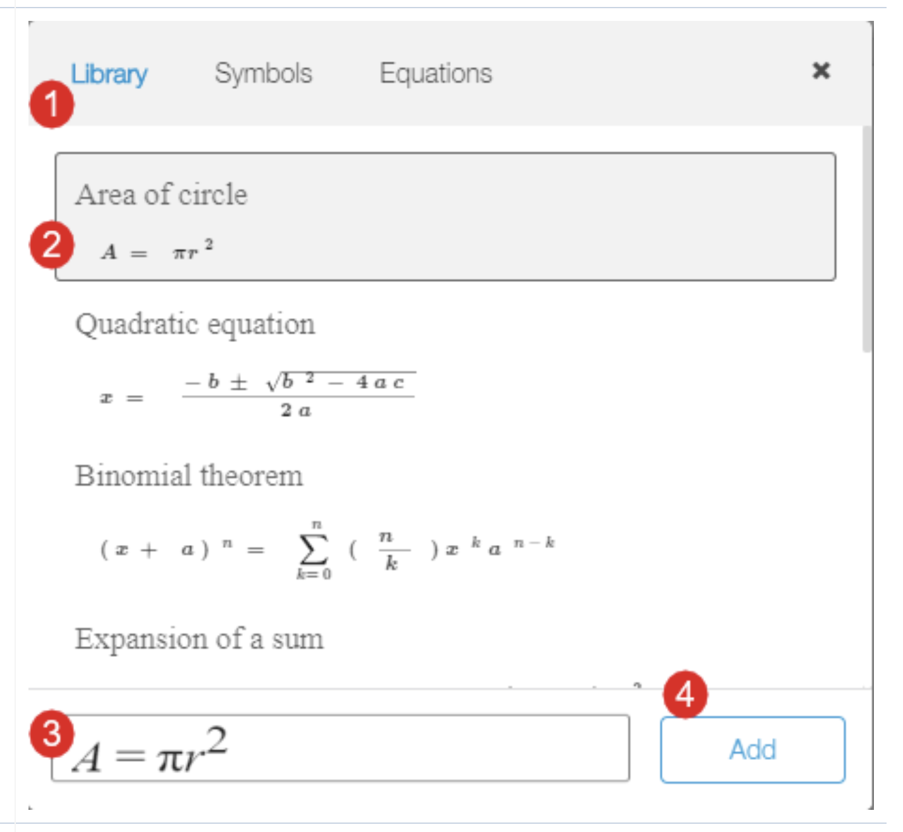
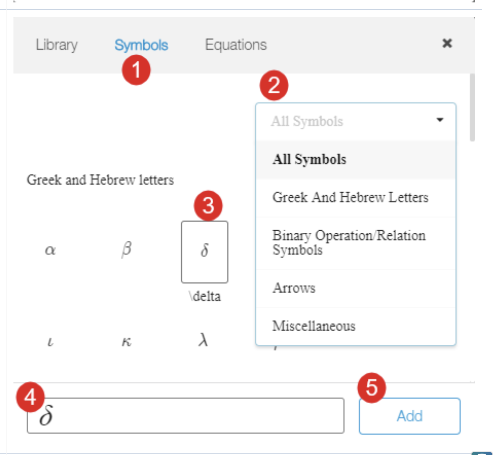
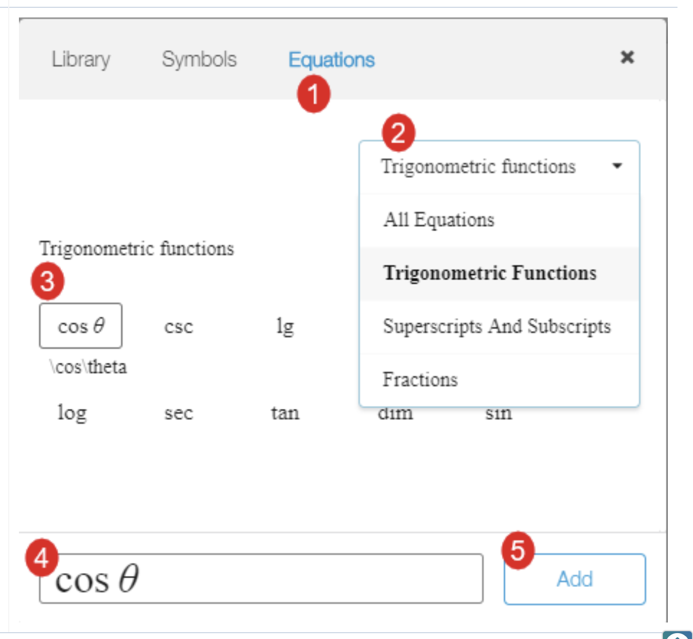

# Adding Math Function

### Adding and Editing Mathematical Formulas 

#### Step 1

1. Click the sigma icon. The math function pop-up is displayed&#x20;
2. 2.Double-click the text box to edit mathematical formula or function

<figure><figcaption></figcaption></figure>

#### Step 2

The **Library** tab displays the list of extensively used mathematical formulas

1. Select **Library** tab
2. Select the formula from the list
3. The expression appears in the text box. You can append the values, add constants and variables in the text box
4. Click **Add** to proceed. The formula is added on the slide in a text box

<figure><figcaption></figcaption></figure>

#### Step 3

The **Symbol** tab displays the list of letters in Greek and Hebrew, binary opeartions and relational symbols, different styles of arrows and other related symbols

1. Select **Symbol** tab
2. Select the type of symbol from the drop-down
3. Select the symbol
4. The symbol appears in the text box. You can append the values, add constants and variables in the text box
5. Click **Add** to proceed. The symbol is added on the slide in a text box

<figure><figcaption></figcaption></figure>

#### Step 4

The **Equations** tab displays the list of mathematical functions&#x20;

1.Select **Equations** tab&#x20;

2.Select the type of equation from the dropdown&#x20;

3.Select the equation&#x20;

4.The equation appears in the text box. You can append the values, add constants and variables in the text box&#x20;

5.Click **Add** to proceed. The equation is added on the slide in a text box

<figure><figcaption></figcaption></figure>
