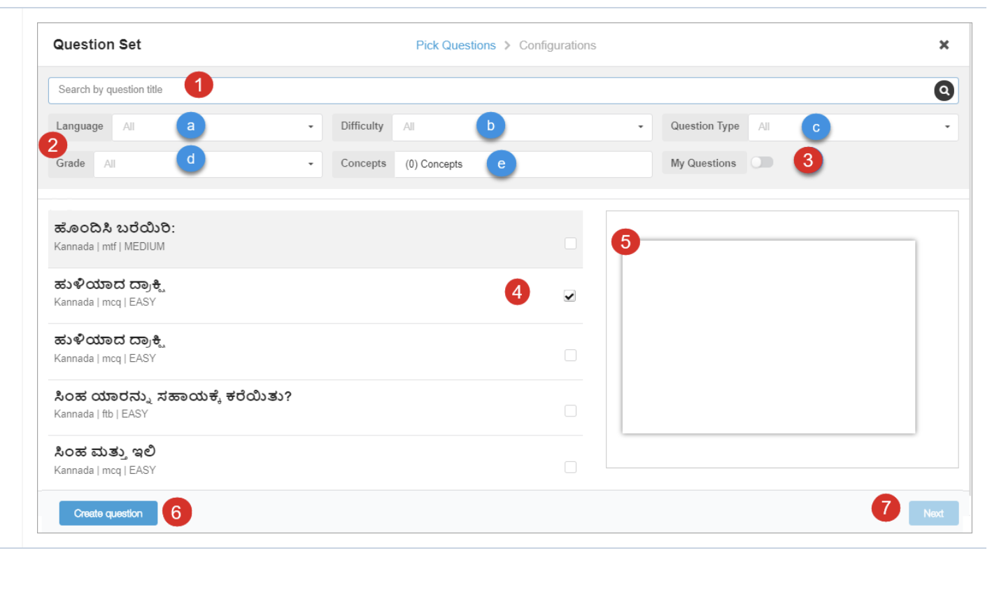

# Adding Question Set

Steps

1. Click the **Add Question Set** icon on the toolbar. The question set browser page is displayed You can add questions to content editor by \
   a Selecting Questions \
   b Creating Questions

<figure><figcaption></figcaption></figure>

#### Searching and Filtering Questions 

On the Question Set page, search for questions or apply filters to narrow down your questions\

1\. Type keywords to search for questions\
2\. Apply filters for better search results using:\
 a) **Language**\
 b) **Difficulty**\
 c) **Question Type**\
 d) **Grade Level**\
 e) **Concepts**. Refer [Concept Selector](concept-selector.md)\
3\. Use **My Questions** slider to search for questions that you have uploaded. To search for questions available on the portal, disable this option\
4\. Select questions from the results displayed on the left pane\
5\. The selected question can be previewed on the right pane\
6\. Click **Create Question** to create your own question.\
7\. Click **Next**

<figure><figcaption></figcaption></figure>

#### Creating Questions 

1. On **Create Question** page select the type of question you want to create
2. You can create following types of question  \
   a) **Fill in the Blanks Question**  \
   b) **Multiple Choice Question**  \
   c) **Match the Following Question**
3. Click **Select**

<figure><figcaption></figcaption></figure>

#### **Creating Fill in the Blanks Question**

1. Enter the question
2. You can format the text, and also include the questions in your preffered language using rich text editor
3. Enter the answers within a pair of square brackets \[\[Answer]]
4. Use **Select Keyboard** option select the text input method as Device, English and Custom. **Note**: You can add up to 26 characters in your preffered language to appear on the custom keyboard
5. Select **Refresh** icon to preview your question
6. Select **Partial Scoring** to enable scoring for each correct answer
7. Click **Next** to enter the Question Details. The **Create** **Question** page appears
8. Select **Back** to go back to the previous page \
   **Note**: Editing a Fill in the Blanks question displays the above options

<figure><figcaption></figcaption></figure>

**Creating Multiple Choice Question**

1\. Enter the question\
2\. Enter the answers\
&#x20; **Note**: You can format the text, and also include the questions in your preffered language using       rich text editor\
3\. Mark the correct answer amongst the multiple answers\
4\. Click **Delete** icon to remove an answer\
5\. Click **Image** icon to add an image. Refer [Adding Images](add-image.md)\
6\. Click **Audio** icon to add an audio\
7\. Select **Refresh** icon to preview your question\
8\. Select the layout from the drop-down menu\
9\. Use **Shuffle** Option to change the sequence of answers\
10.Click **Next** to enter the Question Details. The **Create Question** page appears\
11.Select **Back** to go back to the previous page\
**Note**: Editing a Multiple Choice question displays the above options

<figure><figcaption></figcaption></figure>

#### Configuring Questions 

1. **Name** contains the question entered in the question set
2. Enter **Description**
3. Select the following from the drop-down menu \
   a. Select **Board** \
   b. Select **Medium** \
   c. Select **Class** \
   d. Select **Level**
4. Enter the **Max** Score of the question
5. Select **Refresh** icon to preview your question
6. Select **Partial Scoring** to enable scoring for each correct answer
7. Choose **Select Layout**
8. Select **Shuffle Option**
9. Click **Submit** to configure the question details
10. Select **Back** to go back to the previous page

<figure><figcaption></figcaption></figure>

#### Compiling Question Set 

After creating and/or selecting the questions from the available  questions the questions needs to be compiled together to form the question set that can be readily consumed by the users.

**On Pick Question > Configurations** page&#x20;

1.Enter **Question Set Title** for the question set&#x20;

2.Enter the **Max Score** of the question&#x20;

3.Use **Display** to select the question to be displayed&#x20;

4.Select **Show Immediate Feedback** slider to display the result of the attempted question&#x20;

5.Select **Shuffle Question** icon to shuffle the questions&#x20;

6.Click **Close** icon to remove a question from the question set&#x20;

7.Use **Configure Score** to display the score corresponding to the selected questions&#x20;

8.Select **Add more question** to continue adding more question in the question set

<figure><figcaption></figcaption></figure>

#### Editing and Selecting Questions 

On **Pick Question > Configurations** page&#x20;

1.Select the question using the check box to include it in the question set OR&#x20;

2.You can edit the page using **Edit** icon. The corresponding question is displayed, you can edit the questions accordingly&#x20;

3.Click **Next** to include the questions in Question Set

<figure><figcaption></figcaption></figure>

#### Adding Details to Question Set 

On **Pick Question > Configurations** page

1. **Name** contains the question entered in the question set
2. Enter **Description**
3. Select the following from the drop-down menu \
   a. Select **Board** \
   b. Select **Medium** \
   c. Select **Class** \
   d. Select **Level**
4. Enter the **Max Score** of the question
5. Select **Refresh** icon to preview your question
6. Select **Partial Scoring** to enable scoring for each correct answer
7. Select **Layout**
8. Select **Shuffle Option**
9. Click **Submit** to configure the question details
10. Select **Back** to go back to the previous page

<figure><figcaption></figcaption></figure>

