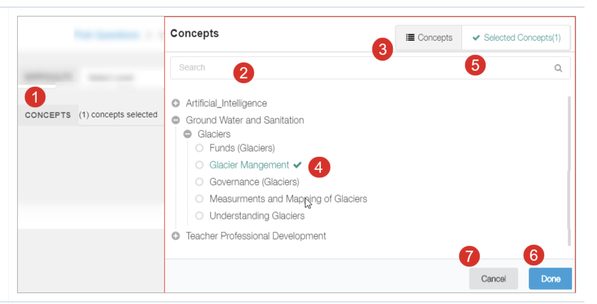

# Concept Selector

#### Steps

1 Click Concepts. The Concepts page is displayed&#x20;

2\. Search the concept using **Search** bar&#x20;

3\. Concept tab displays complete list of the available concepts&#x20;

4\. Browse and select the concept(s) from the concept tree&#x20;

5\. View the selected concepts in **Selected Concepts** tab&#x20;

6\. Click **Done** to proceed&#x20;

7\. Click **Cancel** to exit

<figure><figcaption></figcaption></figure>
