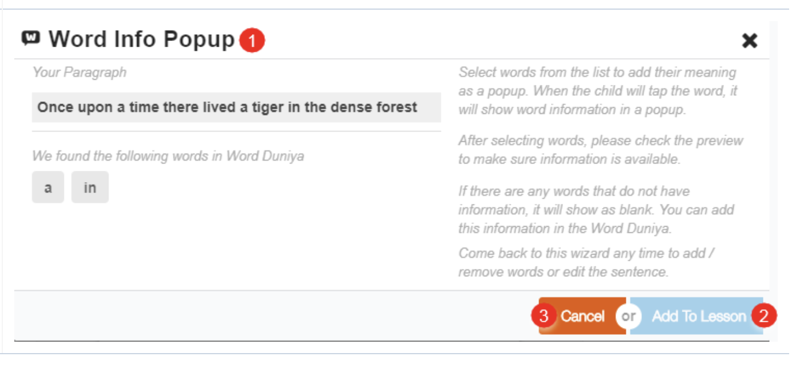

# Content Editor

## Content Editor Parts 

The broad areas of the content editor are:

1. **Toolbar**: A collection of several tools available to create content resources
2. **Preview**: A viewer that allows you to see how content will be displayed when published
3. **Right Pane**: A collection of tabs that allow you to customize defaults for tools from the toolbar, add animation or interactive controls and view information about the slide
4. **Working Area**: The slide that is currently being worked upon
5. **Slide Sorter**: Use this area to order your slides

<figure><figcaption></figcaption></figure>

### Right pane

**Customize Tab and Default Options**

1. **Show Player Control**: A slider button that allows you to view or hide grid lines and the position of player control buttons. This button is not enabled by default. Enabling this option helps you effectively visualize your slide composition
2. **Teacher Instructions**: A pane to enter notes or instructions to teachers, about the slide content
3. **Background Color**: Select the background color of the slide from color bar. The default background color is white

**Actions Tab**

Action tab enables you to add, modify or delete actions to animate objects on the slide. Ensure that you select a target object before you attach an action to it

<figure><figcaption></figcaption></figure>

**Properties Tab**

Properties tab enables you to view information that the editor automatically adds about the slide and the objects on the slid

<figure><figcaption></figcaption></figure>

### Tool Bar

&#x20;While creating content, you can add shape, slide, rich text, image, audio files, video files, hotspot, scribblepad, question sets and activities using the tool bar. An alignment bar is displayed around any items that are added using the tool bar. You can drag, adjust, align and reshape the items using the bar.

#### Adding Slide

1. To add slides, click the **Add Slide** icon
2. Click to add a slide either in the: \
   a) **Beginning**: as the first slide \
   b) **End**: as the last slide \
   c) **After Current**: after the current slide \
   d) **Before Current**: before the current slide \
   **Note**: Drag and drop slides in the left page to reorder them

<figure><figcaption></figcaption></figure>

#### Adding Text 

1. To add text, click the **Add Text** icon
2. Type text into the text box that is added to the slide
3. Click **Done** to add the text box or **Cancel** to remove the text box\
   After clicking **Done**, you can format and reposition the text box

<figure><figcaption></figcaption></figure>

#### **Formatting Text - Customize tab**

On clicking Add text, the customize tab displays options to add features to the text. The Text Formatting feature allows you to modify:

1. **Font**: Pick a new font for your text
2. **Size**: Change font size
3. **Alignment**: Align text to the left, right or center of the text box
4. **Color**: Change color of your text
5. **Transparency**: Change the transparency of your text in relation to the background of the text box
6. The **Read along** feature on the customize tab allows you to add audio to the text on the slide. This is a useful feature to learn pronunciation, enhance vocabulary, etc

<figure><figcaption></figcaption></figure>

#### **Selecting Text for Read Along Audio**

1. Text that you have typed will appear in the text box or you can type text in the text box
2. Click **Select Audio**

<figure><figcaption></figcaption></figure>

#### **Selecting Audio for Read Along Text**

You can add audio to read along text either by selecting an audio file from a list or recording audio immediately

1. Click **My audio** to view a list of all audio files that you have previously uploaded or recorded
2. Click **All audio** to view a list of audio files from the repository Note: The repository contains all audio files added and uploaded by any users
3. **Select** an appropriate audio file from any list and click Select
4. Click **Upload/Record** to record and upload audio immediately

<figure><figcaption></figcaption></figure>

**Selecting Audio for Reading Along**

1. Click Next

<figure><figcaption></figcaption></figure>

**Sync Audio Text with Audio to Read Along**\
****

1. To set the speed of text enunciation, set the playback rate to **Normal, Slow or Slower**
2. Press the **Spacebar** button on your keyboard to space pauses and synchronize words of the sentence with the audio
3. Click A**dd to Lesson** to add the audio file to the text displayed on a screen

<figure><figcaption></figcaption></figure>

**Read Along - Highlighter**\
****

After adding the audio file, you can highlight the text associated with the audio

1. Click the drop-down arrow in the right pane to change the highlight color \
   **Note**: Highlight color refers to the color that is used to highlight the text to sync with the audio
2. Slide the **Autoplay** button, to enable or disable automatic play of the audio file

<figure><figcaption></figcaption></figure>

#### **Word Info**

On clicking Add text, the **Word Info** feature on the customize tab provides all related information about any word added using the content editor \
**Note**: Word Info is available only for those words that already exist in the repository

1. To use this feature, select the word or paragraph in the text box
2. Click **Done** button
3. Click **Word Info**

<figure><figcaption></figcaption></figure>

**Word Info popup**

1. **Word Info Popup** page appears
2. Click **Add to Lesson** button to add words with the meaning
3. Click **Cancel** button to exit the page

<figure><figcaption></figcaption></figure>

**Transliteration**

The process of changing the written script from one language to another is known as transliteration. On clicking Add text, the Transliterate feature on the customize tab allows you to transliterate in ten Indian languages

1. To transliterate, select the word or sentence and click **Transliterate**

<figure><figcaption></figcaption></figure>

#### Language Transliteration Tool

1. Select the language from the drop-down list
2. Click **Transliterate**
3. The original text is displayed in the textbox on the left and the transliterated text is displayed in the text box on the right
4. Click **Add to Stage** to add the transliterated text to the slide

<figure><figcaption></figcaption></figure>

#### Adding Richtext 

1. To add rich text, click the drop-down arrow
2. Click **Add Rich text**, to open **Rich text Editor**

<figure><figcaption></figcaption></figure>

#### Text editor 

1\. Type text into the text box and use the rich text editor for customizing and styling the text. The rich text formatting feature allows you to modify:\

* Pick **Font Formatting**: Bold, Italic, Strikethrough and Remove Format
* **Paragraph Formatting**: Numbered list, Bulleted list
* **Alignment**: Align text to the left, right, center or justify
* **Paragraph Styling**: Normal, Heading 1,2...
* **Font Size**: Pick the different size for the font
* **Color**: Change the color of your text and background

\
2\. Click **Add To Lesson** to add rich text styles\
3\. Click **Cancel** button, to cancel the text formatting\
4\. Click the **Close** icon, to exit the page

<figure><figcaption></figcaption></figure>

#### Adding Shapes 

1. To add shapes, click the Add Shapes icon on the toolbar
2. The customize tab displays options to add features to the shapes. You can: \
   a) Click **Fill** Color to add or modify the color of the shape \
   b) Use the **Transparency** slider to modify the transparency level of the shape \
   c) Use the **Visible** slider to make the selected shape visible or invisible \
   d) Click **Border Color** to modify the color of the shape outline

<figure><figcaption></figcaption></figure>

#### Adding Images 

1. To add images, click the Add Images icon on the toolbar

<figure><figcaption></figcaption></figure>

**Selecting Images**\
****

You can add images either by selecting an image from a list or uploading images from your local machine to use immediately

1. Click **My images** to view a list of all image files that you have previously uploaded
2. Click **All image** to view a list of image files from the repository \
   **Note**: The repository contains all image files added and uploaded by any users
3. Choose an appropriate image file from any list and click **Select**
4. Click Upload and use to **upload and use** images from your gallery

<figure><figcaption></figcaption></figure>

**Uploading and Using Images**\
****

1. Click Choose **File to browse** and select a file from your local drive or open the explorer in a separate window and drag and drop the required file on the screen. \
   **Note**: Supported file formats are: .jpeg, .jpg, .png
2. Under **Copyright & License**, select if you want to: \
   a) Make it available to everyone \
   b) Not share with anyone
3. Add image details in the **Asset Caption** area
4. Click **Upload and Use** to upload the image

<figure><figcaption></figcaption></figure>

**Formatting Images**\
****

After selecting and adding an image to the slide, the customize tab displays options to add features to the shapes. You can:

1. Click **Image Browser** to browse for images and select another image
2. Use the **Visible** slider to make the selected image visible or invisible
3. Click **Border Color** to modify the color of the shape outline

<figure><figcaption></figcaption></figure>

#### Adding Audio 

1. To add audio, click the **Add Audio** icon on the toolbar \
   **Note**: For detailed instructions to add audio, refer to section Select Audio for Read Along Text

<figure><figcaption></figcaption></figure>

**Uploading Audio**\
****

1. Click Choose File to browse and select a file from your local drive or open the explorer in a separate window and drag and drop the required file on the screen. \
   **Note**: Supported file formats are: .mp3, .mp4
2. Under **Copyright & License**, select if you want to: \
   a) Make it available to everyone \
   b) Not share with anyone
3. Add audio file details in the **Asset Caption** area
4. Click **Upload and Use** to upload the audio file

#### Adding Hotspot 

A Hotspot is an invisible button. Attach hotspot to any text, shape, or object to denote any action

1. Click the **Add Hotspot** icon on the toolbar

<figure><figcaption></figcaption></figure>

**Adding Action to the Hotspot**\
****

1. Click the **Action** tab on the right pane
2. Select an interaction from the drop-down menu
3. Select the target object to attach the action from the drop-down menu

<figure><figcaption></figcaption></figure>

#### Adding Scribblepad

1. Click the Add Scribblepad icon on the toolbar
2. You can make modifications using the default options of the customize tab

The Scribblepad helps users take notes if required, while viewing content\

<figure><figcaption></figcaption></figure>

#### Adding Question Set 

To add question set, click the Add Question Set icon on the toolbar. The question set browser page is displayed.\
To ensure that the content achieves the learning objective it is important to check and reaffirm the learner’s progress at different points in the study material. Adding questions and question sets are one method\
1\. Click the Add Question Set icon on the toolbar. For further information, refer [Adding Question Set](http://docs.sunbird.org/2.5.0/features-documentation/questionset\_create)

<figure><figcaption></figcaption></figure>

#### Adding Activity

1. To add activity, click the Add Activity icon on the toolbar

<figure><figcaption></figcaption></figure>

#### **Activity Browser**

You can add activities by selecting activities from the list displayed in the activity browser

1. Filter the displayed list by selecting the: \
   a) Category \
   b) Concepts \
   **Note**: You can choose to filter the list using more than one category and concept
2. Alternatively, you can search for activities by entering keywords
3. Select the activity and click **ADD**

<figure><figcaption></figcaption></figure>

**Adding Details**

1. All details of the selected activity are displayed on the right
2. Click **Add** to add the activity

<figure><figcaption></figcaption></figure>

**Configuring Activity Details**\
****

1. If the selected activity has details added at the time of creation, the appropriate activity category icon is displayed. Click the icon to view or modify activity details
2. If no details have been added, you can enter the activity details in the **Configuring Activity** details screen

<figure><figcaption>
 
</figcaption></figure>

1. Select the following from their respective drop-down menus: \
   a) Content \
   b) Numerals\
   c) Grade \
   d) Level \
   e) Sub Level
2. Determine the No. of Questions
3. Click **Add**

<figure><figcaption></figcaption></figure>

#### Adding Video

1\. To add video, click the Add Video icon on the toolbar. The Video editor page is displayed\
The content editor supports video links from\
  publicly shared videos\
  from Google Drive\
  URL of an MP4 video from online content. To do so, refer to the [Adding Video](add-video.md)\

<figure><figcaption></figcaption></figure>

#### Adding Math Function

&#x20;     This section explains the procedure of using the math text editor to write complex mathematical formulas on the editor.

\
To integrate math function with the editor click Add Activity icon. The Add Activity page is displayed\
\
1\. Enter the keyword **math text** in the search bar\
2\. Click **Search**\
3\. Select the **Math Text** tile from the search result\
4\. Click Add. The **Math** Function symbol (Sigma) appears in the Tool Bar. For further information, refer [Adding Math Function](adding-math-function.md)

<figure><figcaption></figcaption></figure>

#### Adding Details

All details associated with the resource must be updated before sending the resource for review.\
****

1. Enter a **Name** for the resource
2. Enter a **Description**
3. Enter Keywords \
   **Note**: Keywords help search engines find content associated with them when you search
4. Select the following from their respective drop-down menus:  \
   a) Curriculum  \
   b) Class  \
   c) Subject  \
   d) Medium  \
   e) Concepts \
   f) Resource Type  \
   g) Audience
5. Enter Attributions, if any
6. Click **Save**

<figure><figcaption></figcaption></figure>

#### Reviewing and Publishing Content 

All created study material must be reviewed and approved by designated reviewers before it can be published. To send content for review:\
1\. Click Save to save the content\
2\. Click Send for review to send the created content for review\
3\. Before sending for review, you can share the content to a limited audience. To know more this, refer [Limited Publishing and Sharing](http://docs.sunbird.org/2.5.0/features-documentation/limitedpublishnshare)\

<figure><figcaption></figcaption></figure>

### Limitations 

If you select Rich text as a super set plugin, in that case:

1. WYSIWYG works best only if appropriate font name (typeface) is selected as per the language of the text. Existing content using Rich text does not have accurate WYSIWYG. it support WYSIWYG only if appropriate font name is selected.
2. &#x20;In the rich text editor, when we increase the size of the font of the bullet or number list, the bullets or the number size is not increasing proportionately.
