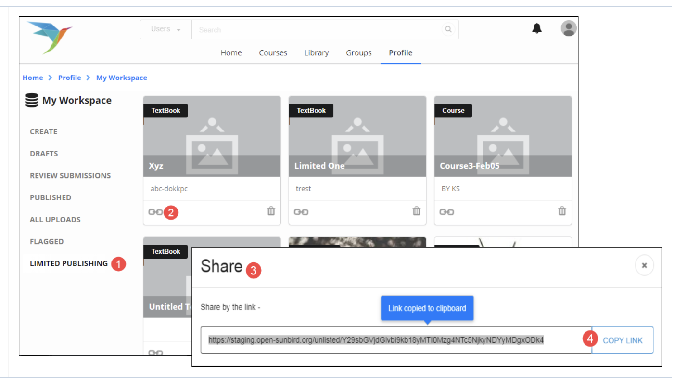

# Limited Publishing and Sharing

Every organization has its own requirements for content creation and publishing. Content can be shared with all, some or specific users within or outside the organization. Sunbird offers the features **Limited Publishing** and **Limited Sharing** that allow you to share content after it is created via a link to select audiences. All users who get the link can view the content, even without logging into Sunbird. This page provides you details on how you can use these features

#### Prerequisites 

* You are logged in as a Content Creator
* You have created content from your workspace
* You have filled the required meta data for the created content

#### Selecting Content for Limited Sharing 

1. Click the drop drop menu beside **Send for Review** icon
2. Click **Limited Sharing** from the drop down. The content is saved and moved to the **Limited Publishing** section of your workspace, from where you can share the link to selected audience \
   **Note**: You can select content for limited sharing before it is sent for review

<figure><figcaption></figcaption></figure>

#### Sharing the Content Link 

1. Click **Limited Publishing**. All content selected for Limited sharing is available here
2. Click **View Link**
3. The **Share link** page is displayed
4. Click **Copy Link** to copy the link. Share the link with your desired audience via e-mail or social media channels
5.

    <figure><figcaption></figcaption></figure>

#### Sending Limited Published Content for Review 

Content selected for limited sharing is not reviewed. To send content (marked as limited sharing) for review:

#### Limited Publishing

1. Click **Limited Publishing**. All content selected for **Limited sharing** is available here
2. Click on the content you want to send for review. The content metadata page is displayed

<figure><figcaption></figcaption></figure>

#### Save

Click Save. You can make changes to the content. if required

<figure><figcaption></figcaption></figure>

#### Send for Review

**Note**: Once the content is shared for review, it will not be available under Limited Publishing. The content after review, will be published on the portal where it will be accessible to all portal users

<figure><figcaption></figcaption></figure>
