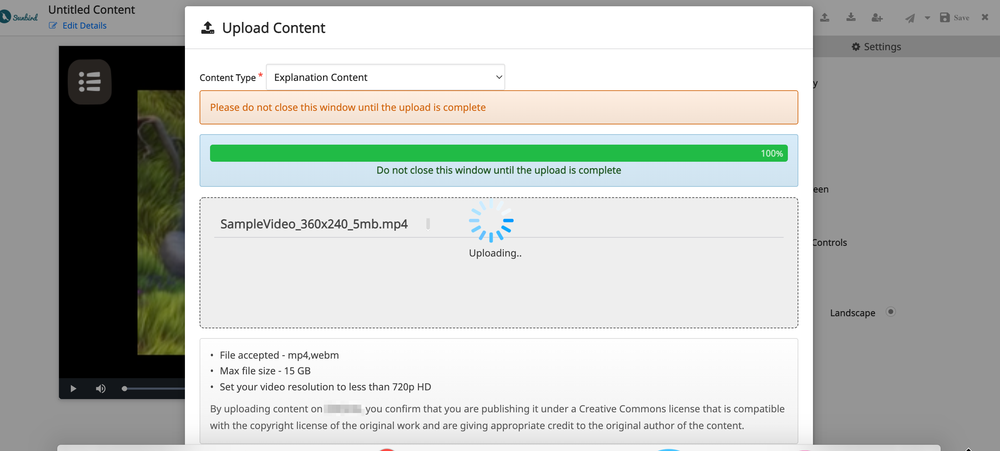

# Features

*   #### Multiple Ways to Upload

    Drop files, select files from the file system, or simply copy and paste file URL..png>)

*   #### Multiple Validation Checks

    Limit your users to upload only specific file type(s) and files upto a specific size limit.\
    .png>)\

*   #### Chunking of Files

    Splitting a file into smaller pieces allows for a more efficient overall upload. File Uploader can also upload multiple chunks for the same file concurrently.\
    \

*   #### Replace already Uploaded Files

    Uploaded the wrong file? Use this feature to replace uploaded files\
    .png>)\

*   #### Preview

    Allows users an in-browser preview of files after they upload.\
    .png>)\

* &#x20;**Download**\
  Allows users an in-browser download of files after they upload\
  .png>)\

* **Limited Sharing**\
  This feature allows creators to share their content to a limited set of users for early feedback.\
  .png>)\

* **Collaboration**\
  This feature enables creators to collaborate with other creators to create content.\
  
