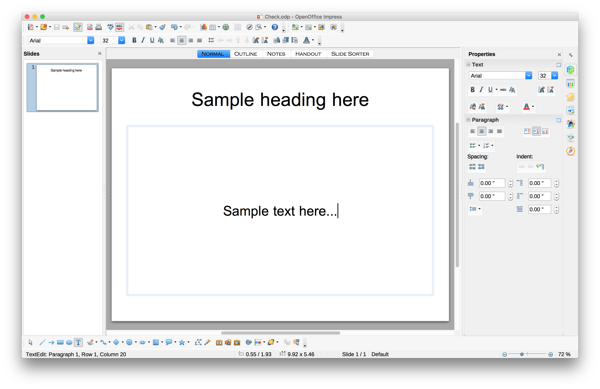
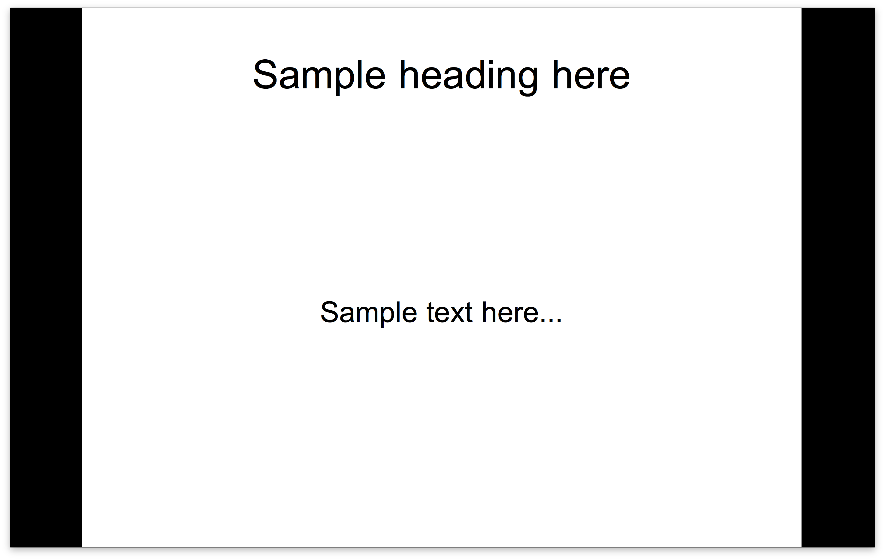
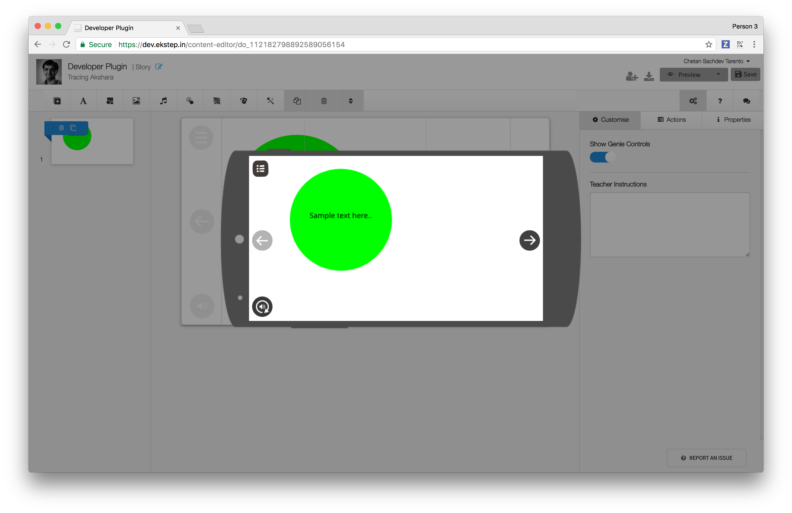

# How do I think about a plugin?

Let's take an example of a desktop application e.g. [Apache OpenOffice](https://www.openoffice.org/).\
Assume you create a presentation file, add some content and then save it. You can access the file again in future, by opening it. The entire content is saved in a format, which can be read by respective app e.g. OpenOffice. OpenOffice stores the files in odp(open document format). The editor in OpenOffice Presentation can understand .odp format and the player/preview understands the same. 

<figure><figcaption></figcaption></figure>


While the editor shows you controls, where you can move objects, add, delete etc.

<figure><figcaption></figcaption></figure>


the preview of the .odp files only shows you the full screen view with all the interactions and controls which you have added on stage.

In a similar fashion, you should think about the plugin. You are going to allow the end user to add objects and interactivity, which then will be stored in the server(How to ECML)]\(ECML-How-to-Guide.md). And the same ecml data is passed to Preview, to play the content.

Below is a screenshot from Content Editor 


and renderer / preview

<figure><figcaption></figcaption></figure>


Refer to our developer plugin guide and explore the Content Editor, if you haven't done so yet. [https://knowlg.sunbird.org/learn/product-and-developer-guide/editors/how-to-contribute-as-a-js-plugin/using-sdk-to-create-and-test-the-plugin](https://knowlg.sunbird.org/learn/product-and-developer-guide/editors/how-to-contribute-as-a-js-plugin/using-sdk-to-create-and-test-the-plugin)

**Alright, I am excited!, How can I develop one?**

To contribute a plugin, you need be familiar with following libraries:

1. FabricJS
2. CreateJS
3. Unit Testing using Jasmine, Karma

**FabricJS**

[http://fabricjs.com/](http://fabricjs.com/) You should refer to fabricjs website and get acquainted with FabricJS library. Refer to [http://fabricjs.com/demos/](http://fabricjs.com/demos/) to see few samples on whats possible. To quickly get started, fork the codepen below, which includes fabricjs and QuickSetting to get you started with fabricjs library. [http://codepen.io/pen?template=MJBgGE](http://codepen.io/pen?template=MJBgGE)

**CreateJS**

[http://www.createjs.com/](http://www.createjs.com/) Refer to createjs website and get acquainted with createJS library. Preview uses createjs library. To quickly get started, fork the codepen below, which includes createjs to get you started with createjs. codepen link here...

**Unit testing**

\<TBU>

**Do you have a wishlist, where I can get some idea?**

Indeed. You can refer to link below to refer to couple of plugins which are in our wishlist. Link here.... (Surendra to add link here)

**Which methods can I extend in Editor?**

We have following properties and methods, which you can extend from BasePlugin.

**Properties**

type

e.g. assessmentbrowser

**Methods**

**initialize**

Initialize the plugin when it is loaded. This is a no-op implementation and child classes must provide the complete functional implementation. Register all events, ensure that you namespace with your plugin, such that it doesn't clash with other plugin events e.g.

```
EkstepEditorAPI.addEventListener("org.ekstep.developer:loadplugin", this.loadPlugin, this);
```

**newInstance**

Instantiate an object of the plugin type. This is a no-op implementation and child classes must provide the complete functional implementation. Tip: Create your fabric object here

**convertToFabric**

Editor and Renderer both keep output in 16:9 ratio. Current canvas size in editor is 720x405, which is 16:9. If you are going to draw any custom shapes, ensure that you do the calculation accordingly here.

**onConfigChange**

Called when the configuration is modified for the plugin. This is useful if the plugin \* has to provide WYSIWYG feedback on the fabric canvas.

**getConfig**

Returns the config for this plugin. Child plugins should override this method to generate the custom plugin JSON objects.

**getAttributes**

Returns the ECML attributes for the plugins. This includes x,y,w,h and rotation related attributes that are common to all plugins.


\
