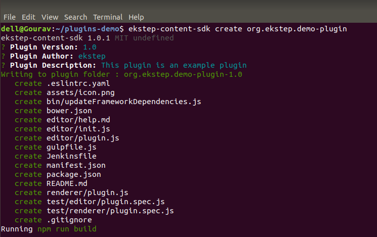
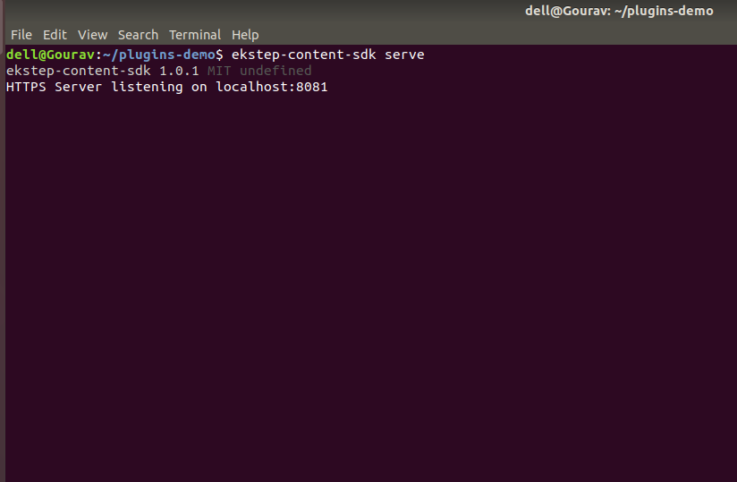
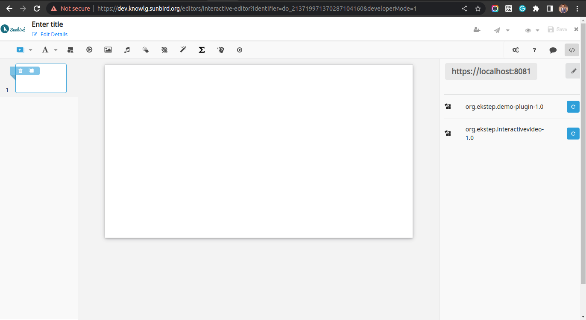

# Using SDK to create and test the plugin

### Install the ekstep-content-sdk

Install the node on your machine and follow the steps to install the EkStep content SDK and create a new plugin:

```
> npm install -g https://github.com/ekstep/EkStep-Content-SDK.git
> ekstep-content-sdk create <pluginname>
> ekstep-content-sdk serve <portnumber: default:8081>
```

### Create a new plugin

<figure><figcaption></figcaption></figure>

### Serve your plugins from your local dev environment

<figure><figcaption></figcaption></figure>

### Enable SSL access for localhost

The local plugin repository, hosted by the EkStep-Content-SDK uses a self-signed certificate to provide SSL access to the plugins under development. You need to enable accessing the localhost with a self-signed certificate in your browser to avoid seeing a security warning. Follow the steps [outlined here](https://improveandrepeat.com/2016/09/allowing-self-signed-certificates-on-localhost-with-chrome-and-firefox/)

### Enable developer mode and load your plugins

1. Login to [https://dev.knowlg.sunbird.org](https://dev.knowlg.sunbird.org/)
2. Create content and launch the interactive editor
3. In the URL add \&developerMode=1 and click enter to reload
4. Now you can see the Add plugin button - click on it to see the editor discover your local plugins and get going That's it! Your developer environment is ready. Refer to the Plugin developer guide or a couple of Plugins from the repo to get started. You can keep editing, and reload the plugin again.

<figure><figcaption></figcaption></figure>
