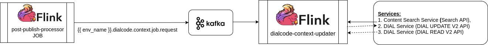
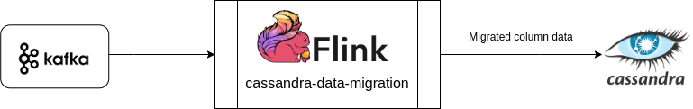
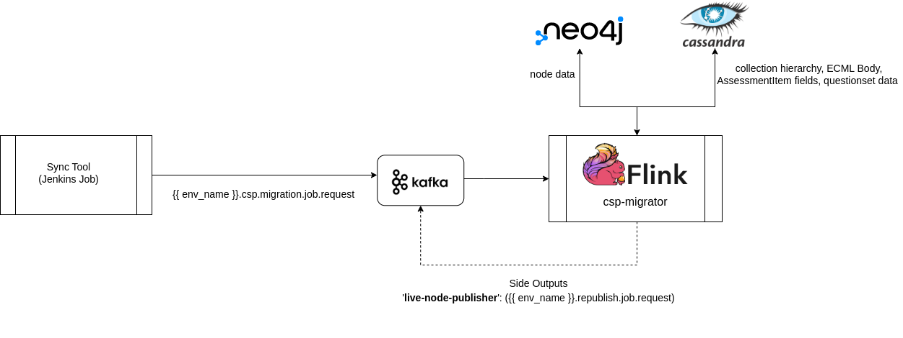
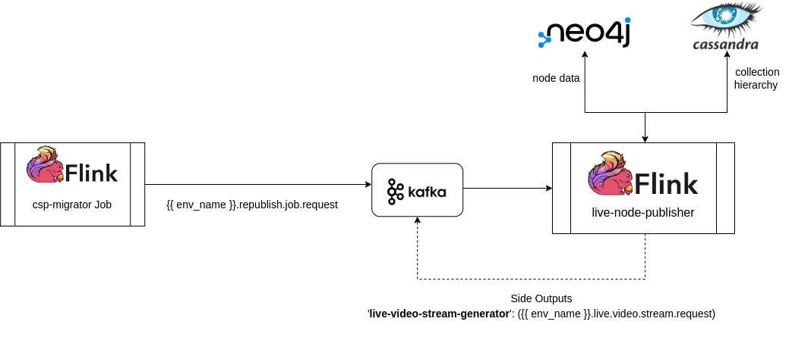

# Other Knowlg Jobs

### :stars: dialcode-context-updater:&#x20;

Job is used to update context information for a linked/de-linked dial codes of a content/collection.




<mark style="color:orange;">**Note:**</mark> Some of the jobs were part of [Samza jobs](https://github.com/project-sunbird/sunbird-learning-platform/tree/master/platform-jobs/samza) before release-4.8.0. Since release-4.8.0, all knowlg jobs are part of [Flink jobs](https://github.com/project-sunbird/knowledge-platform-jobs/tree/release-4.8.0).


### DATA MIGRATION JOBS (Available from release-5.2.0):

### :stars: cassandra-data-migration:&#x20;

Job is used to replace strings in the data of a column in the cassandra database. This can be used for partial String/Blob column data modification only. Configured key Strings will be replaced with the respective value strings where-ever found in the data of each row of the configured keyspace-table-column.

<figure><figcaption></figcaption></figure>



### :stars: csp-migrator:&#x20;

Job is used to replace cloud service provider references in the neo4j and cassandra data of assets/contents/collections to CNAME prefix variable value OR to the new cloud service provider path. Job is triggered for each asset/content/collection in Draft/Live/Image nodes from _<mark style="color:orange;">Sync tool available as part of Jenkins job</mark>_. Migrated contents are stamped with migrationVersion configured as part of the job.

<figure><figcaption></figcaption></figure>



### :stars: live-node-publisher:&#x20;

Job is used to republish already live contents. This job will refer to the data of live node only and not to the data of image node if exists. Please note that image node if exists, will not be deleted from the neo4j. &#x20;

<figure><figcaption></figcaption></figure>



### :stars: live-video-stream-generator:&#x20;

This job is exact replica of the 'video-stream-generator' job. This was created to monitor/control the infra requirement needed for generation of new streaming URLs as part of new cloud service provider migration.&#x20;

<figure><figcaption></figcaption></figure>



