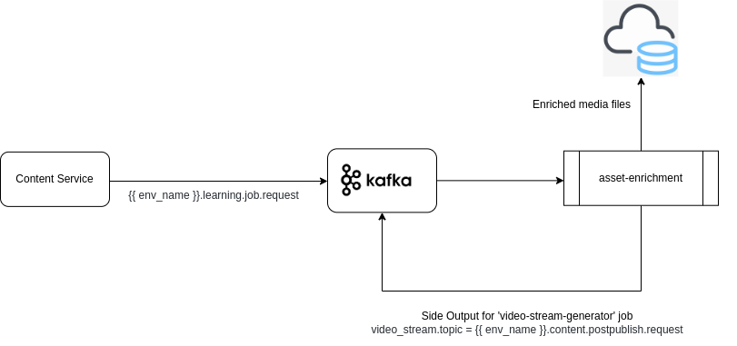
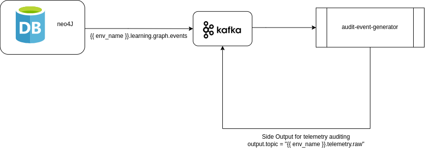
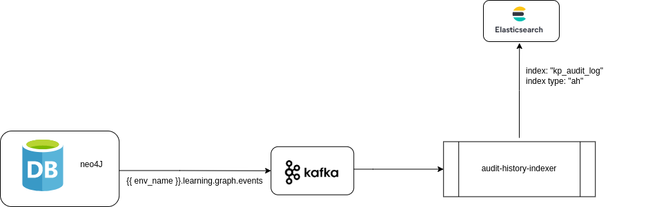
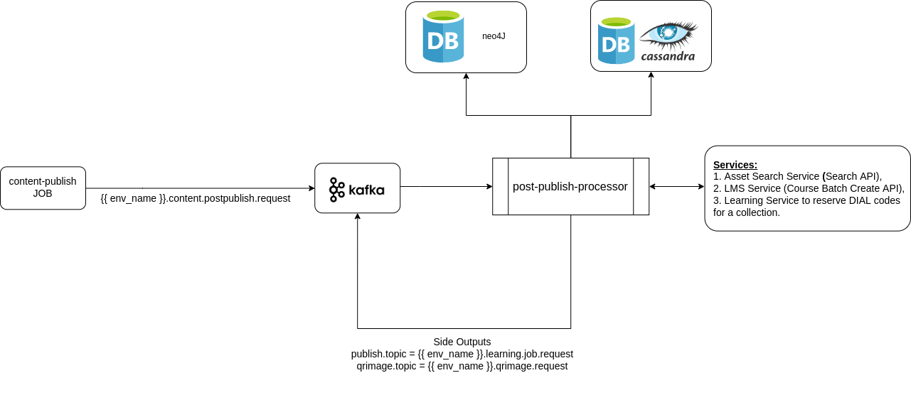
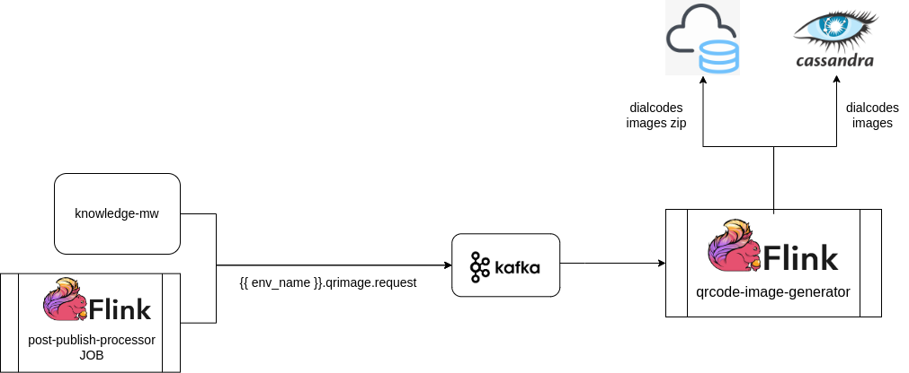
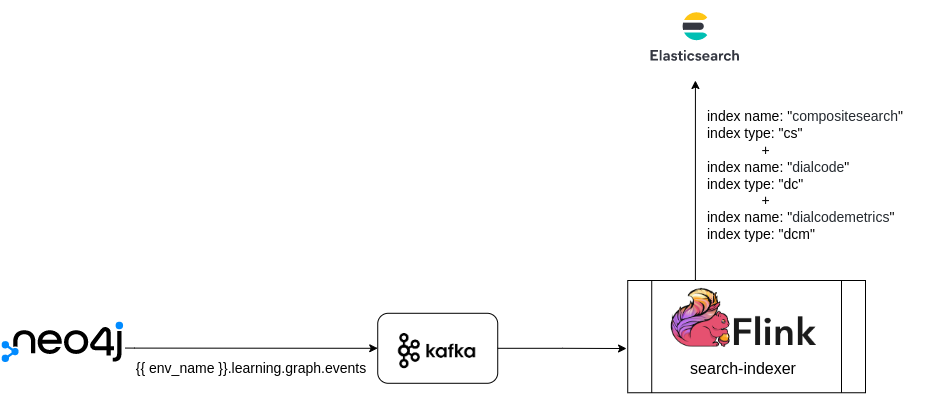

# Knowlg Jobs

### :stars: asset-enrichment:&#x20;

Job handles image and video media files that are part of the uploaded/created contents. Whenever an asset/media file is uploaded as part of the content, an event is generated and inserted to kafka for triggering 'asset-enrichment' job.

* Image Enrichment: As part of image media file enrichment, image resizing with optimal DPI is done. 3 variants (low, medium and high resolution) of the image is generated and stored in cloud.
* Video Enrichment: As part of video media file enrichment, fetching of video metadata, generation of a thumbnail for the video and triggering [video-stream-generator](./#video-stream-generator) job for generation of streamable source is done.



### :stars: audit-event-generator:&#x20;

Job uses the neo4j mutation data to generate AUDIT events of the knowlg objects as per [Sunbird Telemetry spec](http://docs.sunbird.org/latest/developer-docs/telemetry/specification/) which will be consumed by data analytics jobs.



### :stars: audit-history-indexer:&#x20;

Job uses the neo4j mutation data to index transactions for audit purpose. old and new values of the updated object in each neo4j transaction will be audited.



### :stars: content-publish:&#x20;

Job is used for publishing content/collection objects that are submitted for publishing. Job takes care of following functions:&#x20;

* Downloading of media files and packaging them as ECAR for offline consumption.
* Publishing the updated/edited collection hierarchy data.
* Updating content/collection object node metadata with updated publish information viz ECAR paths, versionKey, pkgVersion, streamingUrl, status, etc.
* Indexing collection leaf node objects to Elastic Search.
* Clearing cached note data from Redis.
* Output topics for [post-publish processing](./#post-publish-processor), [video stream generation](./#video-stream-generator) (if streaming is enabled and the content is of streamable mimeType) and mvc indexing (performed by non Knowlg Job).

.png>)



### :stars: post-publish-processor:&#x20;

Job is used for trigerring post publish activities when a collection is published. Like,

* **Shallow Copy:** [Re-publishing herarchy information](./#content-publish) of shallow copy type of collections when an origin collection is published.
* **Default DIAL code generation:** [Reserves DIAL Code](http://docs.sunbird.org/latest/apis/dialapi/#operation/Reserve%20Dialcode), linking and [QR Code image generation](./#qrcode-image-generator) for reserved DIAL code by default for a 'Course' primaryCategory object.
* **Course Batch Creation:** Based on 'traceability' configuration, triggering auto [batch creation](http://docs.sunbird.org/latest/apis/coursebatchmanapi/#operation/CourseBatchCreate) for a 'Course' primaryCategory object if there is no running batch existing.




_<mark style="color:blue;">**Note:**</mark>_ <mark style="color:blue;"></mark><mark style="color:blue;"></mark> Side output topic 'publish.topic = \{{ env\_name \}}.learning.job.request' which is currently serviced by 'publish-pipeline' Samza job will be updated to 'publish.topic = \{{ env\_name \}}.**publish**.job.request' to be serviced by 'content-publish' Flink job.


### :stars: qrcode-image-generator:&#x20;

Job is used for generating QR Code images for the reserved DIAL codes of a collection using the process Id generated when the [DIAL code reserve API](http://docs.sunbird.org/latest/apis/dialapi/#operation/Reserve%20Dialcode) is invoked.



### :stars: search-indexer:&#x20;

Job uses neo4j transactions to index the objects' metadata into Composite search index, DIAL code index and DIAL code metrics index in Elaticsearch.



### :stars: video-stream-generator:&#x20;

Job is used to generate streaming media of the uploaded video contents (mp4 and webm mimeTypes).




<mark style="color:orange;">**Note:**</mark> Some of the jobs were part of [Samza jobs](https://github.com/project-sunbird/sunbird-learning-platform/tree/master/platform-jobs/samza) before release-4.8.0. Since release-4.8.0, all knowlg jobs are part of [Flink jobs](https://github.com/project-sunbird/knowledge-platform-jobs/tree/release-4.8.0).


