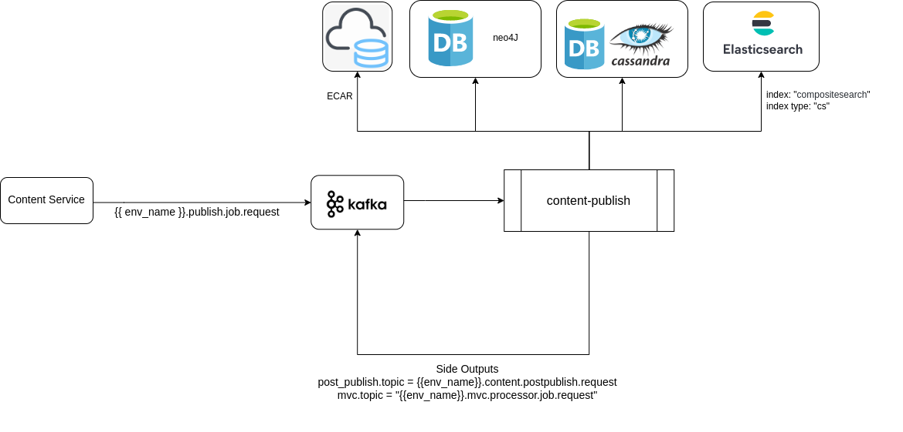

# Knowlg Jobs

### :stars: asset-enrichment:&#x20;

Job handles image and video media files that are part of the uploaded/created contents.&#x20;

* Image Enrichment: As part of image media file enrichment, image resizing with optimal DPI is done. 3 variants (low, medium and high resolution) of the image is generated and stored in cloud.
* Video Enrichment: As part of video media file enrichment, fetching of video metadata, generation of a thumbnail for the video and triggering video-stream-generator job for generation of streamable source is done.

.png>)



### :stars: audit-event-generator:&#x20;

Job uses the neo4j mutation data to generate AUDIT events of the knowlg objects as per [Sunbird Telemetry spec](http://docs.sunbird.org/latest/developer-docs/telemetry/specification/).



### :stars: audit-history-indexer:&#x20;

Job uses the neo4j mutation data to index transactions for audit purpose. old and new values of the updated object in each neo4j transaction will be audited.



### :stars: post-publish-processor:&#x20;

Job is used for trigerring post publish activities when a collection is published. Like,

* Shallow Copy: Re-publishing herarchy information of shallow copy type of collections when an origin collection is published.
* Default DIAL code generation: DIAL Code generation, linking and QR Code image generation for reserved DIAL code by default for a 'Course' primaryCategory object.
* Course Batch Creation: Based on 'traceability' configuration, triggering auto batch creation for a 'Course' primaryCategory object if there is no running batch existing.

.png>)



### :stars: content-publish:&#x20;

Job is used for publishing content/collection objects that are submitted for publishing. Job takes care of downloading of media files and packaging them as ECAR for offline consumption.



### :stars: qrcode-image-generator:&#x20;

Job is used for generating QR Code images for the reserved DIAL codes of a collection using the process Id generated when the [DIAL code reserve API](http://docs.sunbird.org/latest/apis/dialapi/#operation/Reserve%20Dialcode) is invoked.



### :stars: search-indexer:&#x20;

Job uses neo4j transactions to index the objects' metadata into Composite search index and DIAL code index in Elaticsearch.



### :stars: video-stream-generator:&#x20;

Job is used to generate streaming media of the uploaded video contents (mp4 and webm mimeTypes).




<mark style="color:orange;">**Note:**</mark> Some of the jobs were part of [Samza jobs](https://github.com/project-sunbird/sunbird-learning-platform/tree/master/platform-jobs/samza) before release-4.8.0. Since release-4.8.0, all knowlg jobs are part of [Flink jobs](https://github.com/project-sunbird/knowledge-platform-jobs/tree/release-4.8.0).


