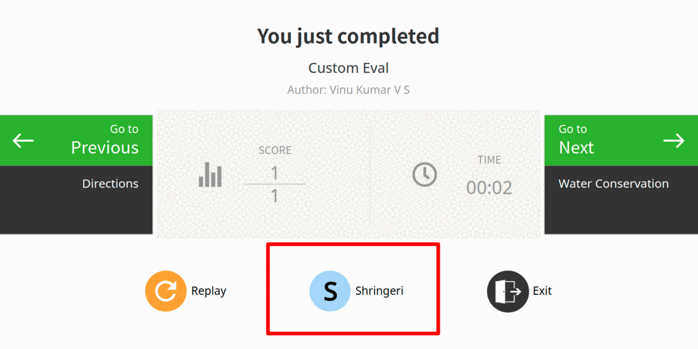
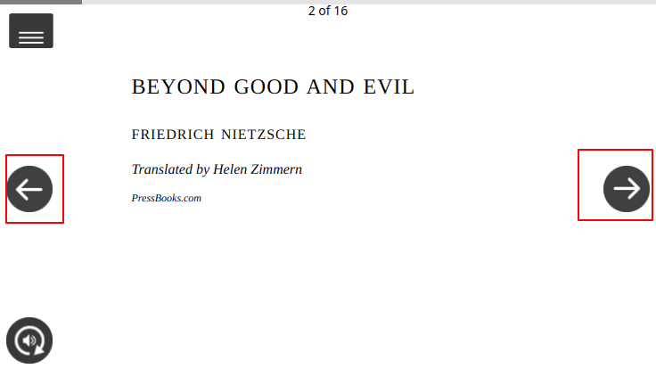

# Features

### **Overlay**

Overlay is used to show some extra information on top of the content. This is a configurable properties

* **User switcher** _(enableUserSwitcher)_**:** Content player v1 has the capability to enable multi-user with this feature. The _enableUserSwitcher_ is a overlay property and it is used to switch between users while playing content.



* **Show user \_** (showUser)\_**:** Player provide the capability to hide and show the users while rendering the content. The show/hide user-switcher functionality. default is true to show user information
* **Show Overlay** _(showOverlayshowOverlay)_**:** This property enhance the content player capability to show extra information about contents. Default is true.
* **Show next** _(showNext)_**:** This is a navigation property of next button for content. You can hide and show the next navigation button. Default is true.
* **Show previous** _(showPrevious)_**:** This is a navigation property of previous button for content. You can hide and show the previous navigation button. Default is true.
* **Show Submit** _(showSubmit):_ This is used to show a submit button after attending the assessment. Default is true.
* **Show reload** _(showReload)_**:** Show reload button is used to reload or re-render the stage. This is a configurable property to show/hide this reply button. Default is true.

#### Sample overlay config

```
"overlay": {
    "enableUserSwitcher": true, // enable/disable user-switcher, default is true for mobile & preview
    "showUser": true, // show/hide user-switcher functionality. default is true to show user information
    "showOverlay": true, // show/hide complete overlay including next/previous buttons. default value true
    "showNext": true, // show/hide next navigation button on content. default is true
    "showPrevious": true, // show/hide previous navigation button on content. default is true
    "showSubmit": false, // show/hide submit button for assessmetns in the content. default is false
    "showReload": true, // show/hide stage reload button to reset/re-render the stage. default is true
    "menu": {
        "showTeachersInstruction": true // show/hide teacher instructions in the menu
    }
}
```

### **Splash screen**

User can customise the loading screen of the content player using below configuration

```
"splash": {
   "text": "Powered by Sunbird", // Text to be shown on splash screen while loading content. 
   "icon": "assets/icons/icn_genie.png", // Icon to be show on above the text(full absolute path of the image in mobiew or http image link)
   "bgImage": "assets/icons/background_1.png", // backgroung image used for splash screen while loading content(absolute folder path of the image in mobie or http image link)
   "webLink": "XXXX" // weblink to be opened on click of text
}
```

### **Navigate**

This navigate feature will provide the user to view previous and next page from given page [PDF player](players/pdf-player-v1.md) only provides to jump to any specific location capability.



### **Side menu**

This is one of the property of [overlay config](content-player-v1.md#overlay). This allows user to perform the following actions based input config provided.

.gif>)

* **Replay**: Its a default feature of the side menu. By clicking on  'replay' user can play the content again.
* **Switch user:** Side menu enables user to switch the current user by clicking on this side menu option. Refer [user switcher config](content-player-v1.md#sample-overlay-config) to configure this button.
* **Mute:** Side menu allows user to mute and unmute the sound of the content. Default is unmute.
* **Exit:** Its a default feature of the side menu options and user can exit the content bu clicking on this button
* **Read teacher instructions:** While creating the [ECML type content](players/ecml-player-v1.md) if creator added the instruction to the stage, each stage will show that instructions. This is a configurable property of the side menu

**Sample config to show the instructions**

```
"menu": {
    "showTeachersInstruction": true // show/hide teacher instructions in the menu
}
```

### **End page**

Content player allows to show the customise page after rendering the content. _**showEndPage**_ property defines to show this page as a end page. This end page will have the following buttons to interact with the contents

Sample config to show end page

```
"config" : {
    showEndPage: true
}
```

* **Previous:** In a collection play - the previous button will indicate the previous content in the collection.

.png>)

* **Score:** This will indicate the user's score on the end page
* **Time:** This will indicate - how much time user has spent on the content.
* **Name :** It shows the Name of the content. This will show as per the name property of the content metadata.
* **Creator:** It shows the Name of the content creator. This will show as per the creator property of the content metadata.
* **Replay:** By clicking on the replay button user can reload the content. Its a default property of the end page.
* **Username:** Initial letter of the user will show on the end page. By clicking on this button user switcher popup will show - witch allows you to select and switch the user.
* **Exit:** By clicking on the Exit button user can exit the content and application.

### Next and previous

Next and previous buttons are used see the next and previous slide of the content. On end page, the next and previous button can be configured.

To show these buttons on the end page, you have to expose the service methods. Please refer to [these services](https://github.com/project-sunbird/sunbird-content-player/tree/9fc06f842ff2bc0bd1b1143d288caed1075ada83/player/public/services) for more information.

Sample API response to show the next and previous button

```
{
  "next": {
    "content": {
      "contentData": {
      }
    }
  },
  "prev": {
    "content": {
      "contentData": {
      }
    }
  }
}
```


