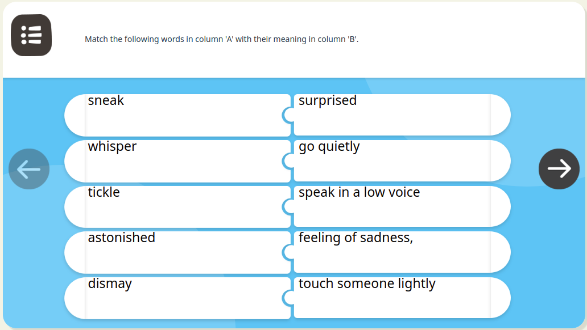
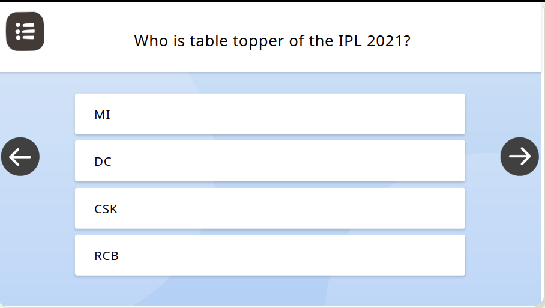
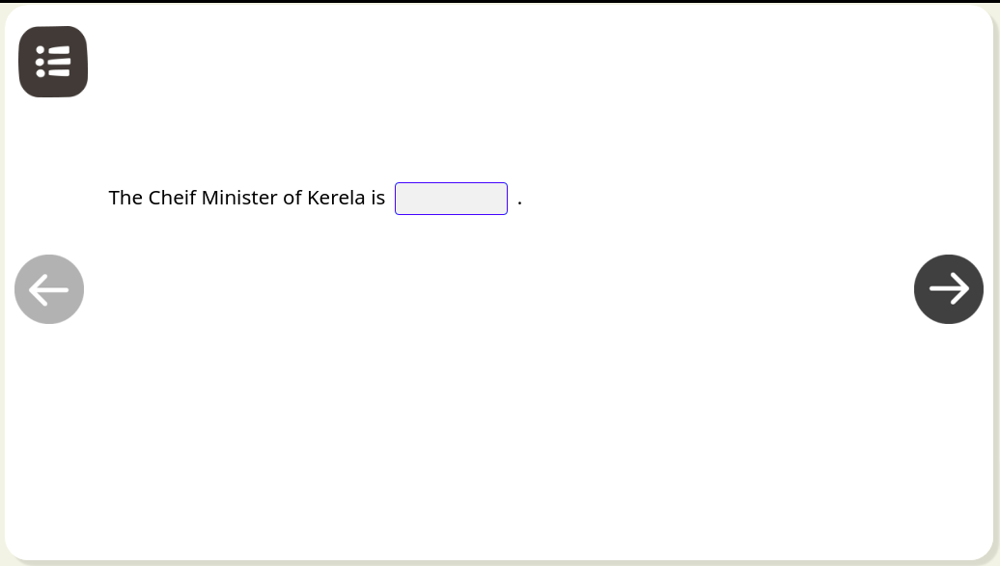

# Quiz

[Interactive editor](../../../../../../use/installation-guide/editors/interactive-editor.md) is responsible to creation of assessment assets. Content player v1 is capable to play the assessment type asset which is written in [Ekstep content markup language](./)

## Types of quiz

There are following types of assessment can be taken in [ECML player v1](./).

### MTF

MTF is the short form of 'Match the following' questions. v1 player is capable to play the MTF type quiz. This capability provide user to drag and drop the options within a canvas area and also provide the capability to calculate the [partial score](quiz.md#partial-score).



### MCQ&#x20;

Using v1 player you can render the Multiple choice Question type assets. In this type of questions user has to select the correct options. if the answer is correct, it will show the score in [evaluation popup.](quiz.md#score)



### FTB&#x20;

FTB is stands for 'Fill in the blank' type questions. In this type of question v1 player is capable to show the [partial score](quiz.md#partial-score) if some of the answer is correct.



### Reordering words

This type of questions provide user the capability to drag and drop the options within a canvas area to order and reorder the words&#x20;

.gif>)

### Arrange in Sequence

In a content player v1 you can render the arrange in sequence type questions.

.gif>)

Interactive editor is responsible to creation of assessment content. Following plugins are plays the role to play the assessments in content player

## Configurations

Content player v1 is capable to renderer all above mentioned [types of quiz](quiz.md#quiz-types) and this can be configure by using the following configuration

**Question Minimum Font Size**

What should be the the minimum font size can be render in content player v1 defines by the _questionMinFontSize_ property.

```
{
    questionMinFontSize: '1.285em'
}
```

#### Show submit

Show submit property present the show button on end page, which will show after attempting the assessment. This is a configurable property of [overlay config](../../content-player-v1.md#overlay) of content player v1.


Sample config to show submit button.

```
overlay: {
    showSubmit: false
}
```

## Evaluation popup

The content player v1 is capable to show the quiz score after end of the assessments. To enable this feature, we need to config the [submit button](quiz.md#show-submit) property.&#x20;

After every question rendered, the ECML player v1 will show the evaluation popup which helps user to understand the answered option is [correct](quiz.md#correct-answer) or [wrong](quiz.md#wrong-answer).

#### Correct answer

If the answer is correct, evaluation popup will show the correct icon popup and next button to go to the next question


#### Wrong answer

If the answer is wrong, evaluation popup will show the wrong icon popup with next and try again button.


#### Partial score

The partial score can be calculate for [MTF](quiz.md#mtf) and FTB type questions


## End Page

After rendering the quiz, the content player v1 is capable to show the final score on the end page of the asset. Please refer [end page section](../../content-player-v1.md#end-page) for more information.
