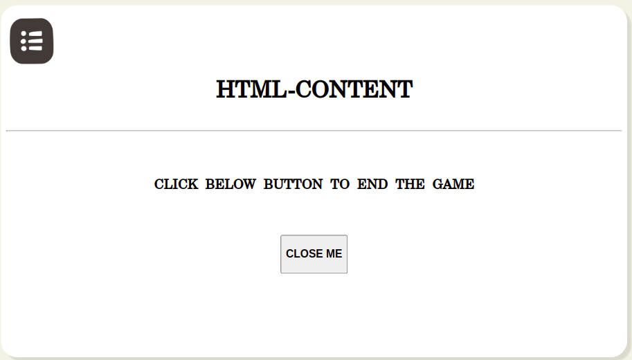

# HTML-h5p Player - v1

## Overview

Html Player is used to play the html and h5p files. These files can be renderer offline.



#### Mime type

```
"mimeType": "application/vnd.ekstep.html-archive"
```

## ****

## **Configuration**

Below is the configuration metadata to render/play html/h5p content:

```
"metadata": {
    "artifactUrl": "https://sunbirdstagingpublic.blob.core.windows.net/sunbird-content-staging/content/do_21339805065209446416747/artifact/zip-95kb_1635504230861_1635504790958.zip",
    "identifier": "do_21339805065209446416747",
    "mimeType": "application/vnd.ekstep.html-archive", // this could be html of h5p
    "streamingUrl": "https://sunbirdstagingpublic.blob.core.windows.net/sunbird-content-staging/content/html/do_21339805065209446416747-latest"
}
```

Please refer to the [config section of README.md ](https://github.com/project-sunbird/sunbird-collection-editor#how-to-configure)file of the below [git repository](https://github.com/project-sunbird/sunbird-collection-editor)

## Features

#### **Interact with player**

Interact with player by using the html interface library.

Add the following to your HTML Content:

The file\_path is the relative path (eg. assets/js) to these files within the html content.

```
<!-- HTML Interface  JS library -->
<script src="[relative_path]/htmlinterface.js"></script>

//you can log telemetry interact event as shown below
org.ekstep.contentrenderer.interface.telemetryService.interact(data) 
//or 
RI.telemetryService.interact(data)
```

Please refer to these [developer documents](https://telemetry.sunbird.org/use/html\_interface\_library) for more information.
