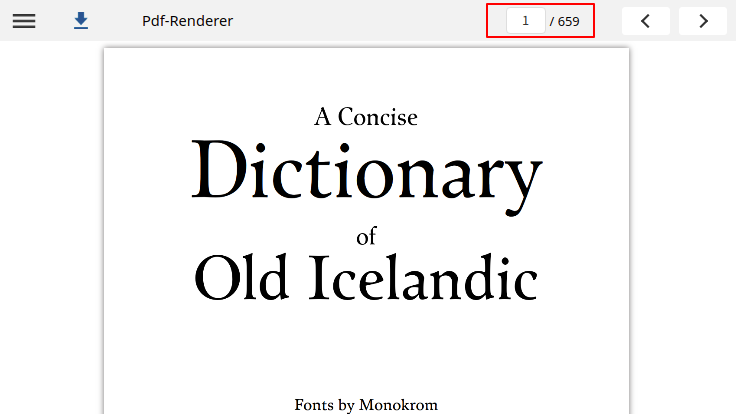
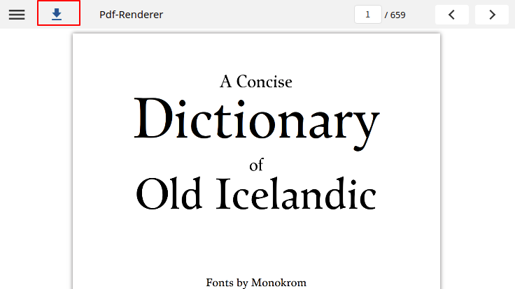

# PDF Player - v1

## Overview

Pdf Player is used to play the pdf files and user can navigate and see the page numbers of the pdf file page. The pdf file can be renderer online and offline.

#### Mime type

```
 mimeType: "application/pdf"
```

## **Configuration**

Below is the configuration metadata to render/play pdf content:

```
"metadata": {
    mimeType: "application/pdf",
    artifactUrl: "https://sunbirdstagingpublic.blob.core.windows.net/sunbird-content-staging/content/do_21310354431597772814733/artifact/pdf_13.pdf"
    contentType: "Resource",
    identifier: "do_21310354431597772814733"
    mediaType: "content",
    streamingUrl: "https://sunbirdstagingpublic.blob.core.windows.net/sunbird-content-staging/content/do_21310354431597772814733/artifact/pdf_13.pdf"
}
```

## Features

1. **Jump to page**\
   This navigate feature will provide the user to jump to any number of page in given pdf content and also able view previous and next page from given page\
   

**2. Download pdf**

User can download the pdf content by clicking on the download icon


