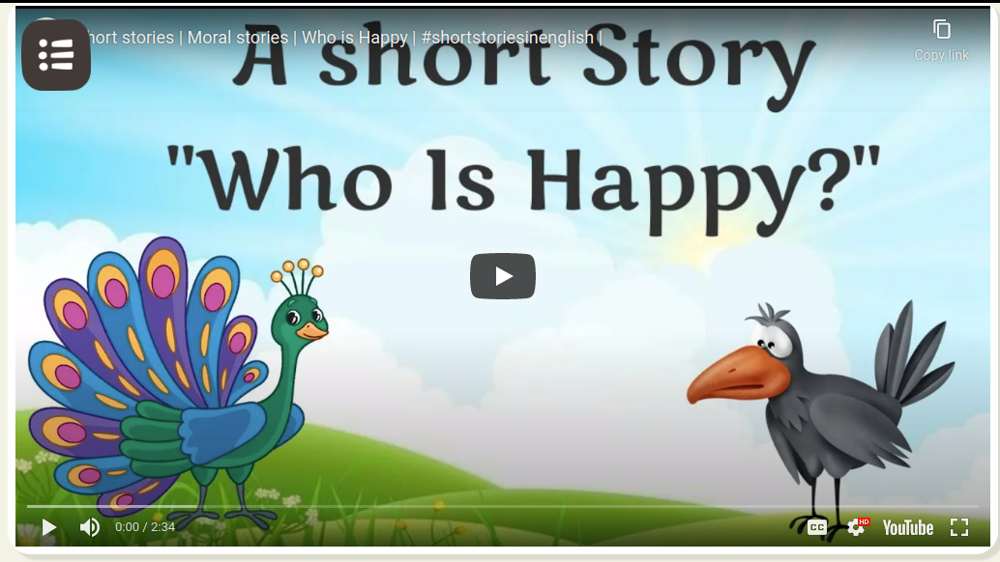
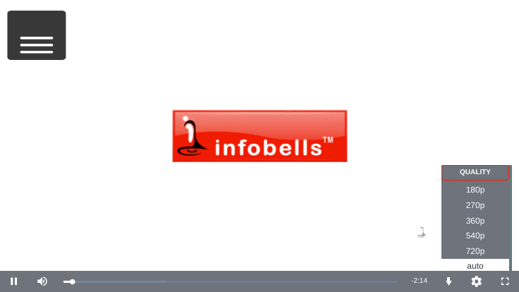
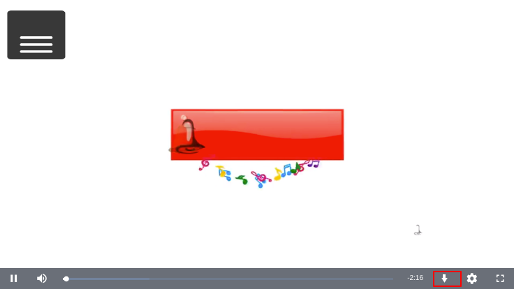

# Video Player v1

## Overview

Mp4, webm and youtube type video can be render in video player v1. Video renderer is the common renderer which supports the following video mime types

#### Mime type

```
"video/mp4", "video/webm", "audio/mp3"
```

## Configuration

Based on the following metadata configuration video assets can be rendered.

```
"metadata": {
    mimeType: "video/mp4"
    primaryCategory: "Teacher Resource",
    artifactUrl: "https://sunbirdstagingpublic.blob.core.windows.net/sunbird-content-staging/content/do_2133803600096624641146/artifact/do_2133803600096624641146_1633348628271_do_2133803600096624641146_1633345648679_mp4_212.mp4",
    contentType: "MarkingSchemeRubric",
    identifier: "do_2133803600096624641146",
    "mediaType": "content",
    streamingUrl: "https://sunbirdspikemedia-inct.streaming.media.azure.net/e785cfbe-f6ac-42e4-a725-baedd50efcb3/do_2133803600096624641146_163334.ism/manifest(format=m3u8-aapl-v3)"
}
```

## Features

Content Player v1 supports to play the following types of video contents

### **Youtube**

You can render the video of video/x-youtube mime type. Content player v1 takes the youtube url and play the youtube url online. The youtube player will not work offline. The download button is also not available for youtube content.



YouTube player is capable to show the following YouTube controllers:

* Play pause buttons
* Streaming video controls
* Full screen
* Caption reader
* Timer

### Mp4/Mp3 and Webm

Content player supports to play video/mp4 mime type video contents.  Video/Webm mime type video contents comes under this category. The video renderer is also capable to play the Mp3 file.

#### **Streaming video**

Mp4 contents can be played online and offline. The streamingUrl enhanced the capabilities of video renderer player so that user can control the streaming playback speed. The Streaming options will show for this type of contents where user can select the streaming options.&#x20;



Sample streaming URL in metadata

```
metadata: {
     "streamingUrl": "https://sunbirddevmedia-inct.streaming.media.azure.net/624b8eb7-d10b-4b48-a325-279a9d936374/mp4_9.ism/manifest(format=m3u8-aapl-v3)",
}
```

#### Download

This is the default button on the mp4/webm player. By clicking on this button user can download the video file.

&#x20;


