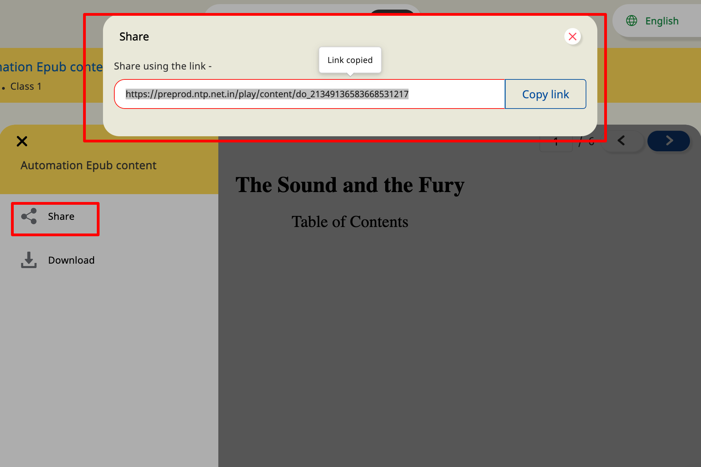
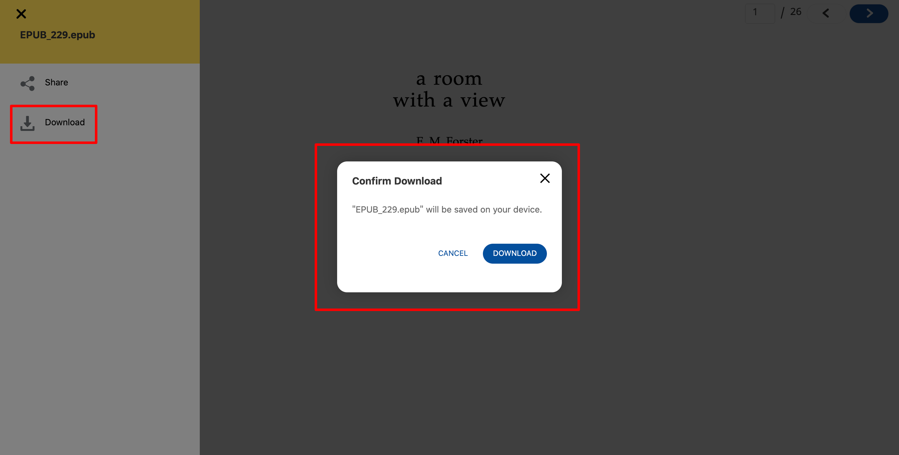

# Features

<details>

<summary><strong>Navigate</strong></summary>

&#x20;Navigate feature allows user to jump to a specific page and also navigate between previous and next pages. \
\


</details>

<details>

<summary>Progress</summary>

This feature informs users their progress within the document.\
\


</details>

<details>

<summary>Side Menu</summary>

Side menu has features like share & download.

*   **Share**: \
    &#x20;This feature allows for sharing content link. The default value is false.\


    sample config to enable is\
    ****&#x20;

    ```
    "config": { 
        "sideMenu": { 
          "showShare": true, // show/hide share button in side menu. default value is false     
        }
    }
    ```

    \
    \


<!---->

*   **Download**\
    ****This download feature allows for content download. The default value is false.\


    sample config to enable is\
    **** &#x20;

    ```
    "config": {
         "sideMenu": {      
          "showDownload": true, // show/hide download button in side menu. default value is false  
        }
    }
    ```

    ****\
    ****

</details>
