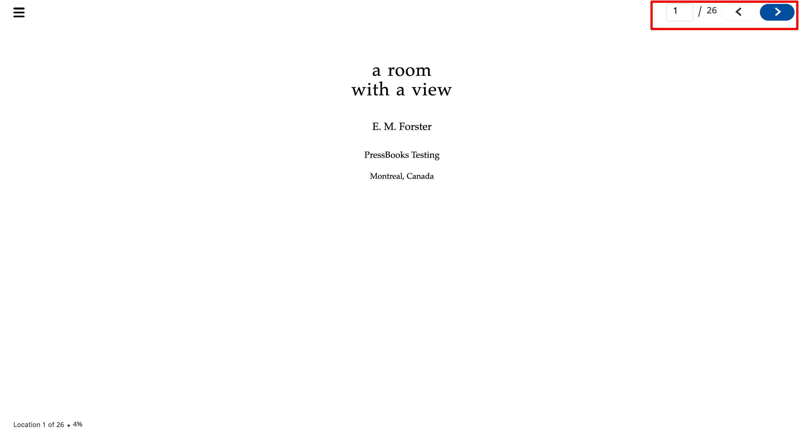
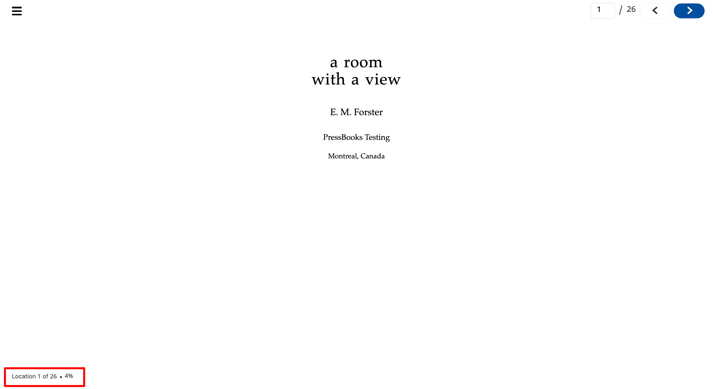

# Features

<strong>Navigate</strong>

&#x20;Navigate feature allows user to jump to a specific page and also navigate between previous and next pages. \
\

Progress

This feature informs users their progress within the document.\
\

