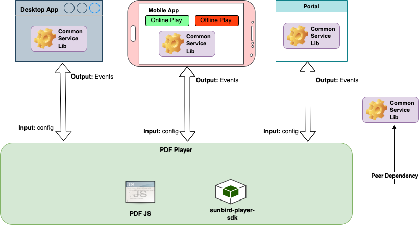

# Architecture

The below diagram represents the PDF player components.

<figure><figcaption>
PDF Player
</figcaption></figure>

### Flow-diagram&#x20;

##

**Common Service Lib:**\
This is used for generating the telemetry from the player as a utility dependency library.

**Sunbird Player SDK:**

SDK contains common components used by all the V2 players to make it consistent and reusable across players, It contains Start, End Page components along with Navigation and Side menu components

**PDF JS:**

PDF Js library is used for rendering the pdf content and it will also provide options to implement zoom, rotate, and navigation features. Refer [here](https://github.com/mozilla/pdf.js) for more details
