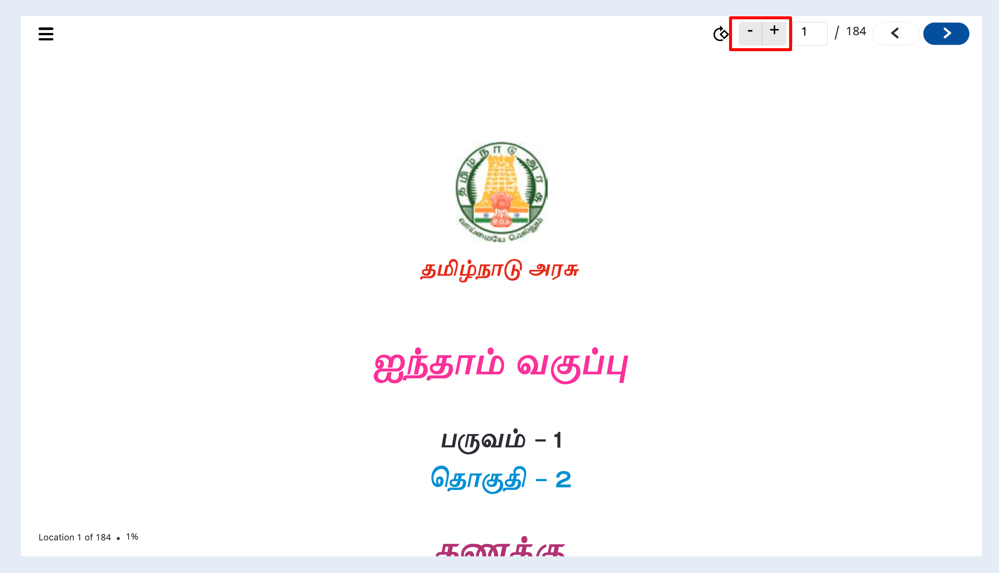
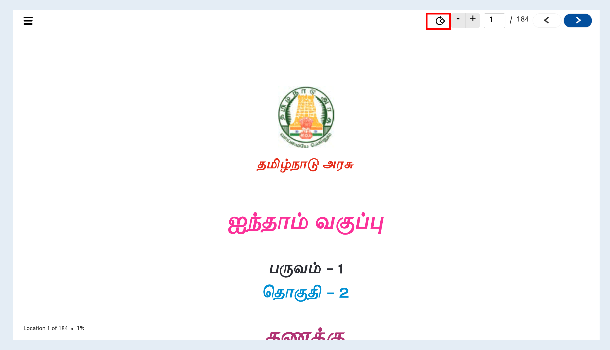
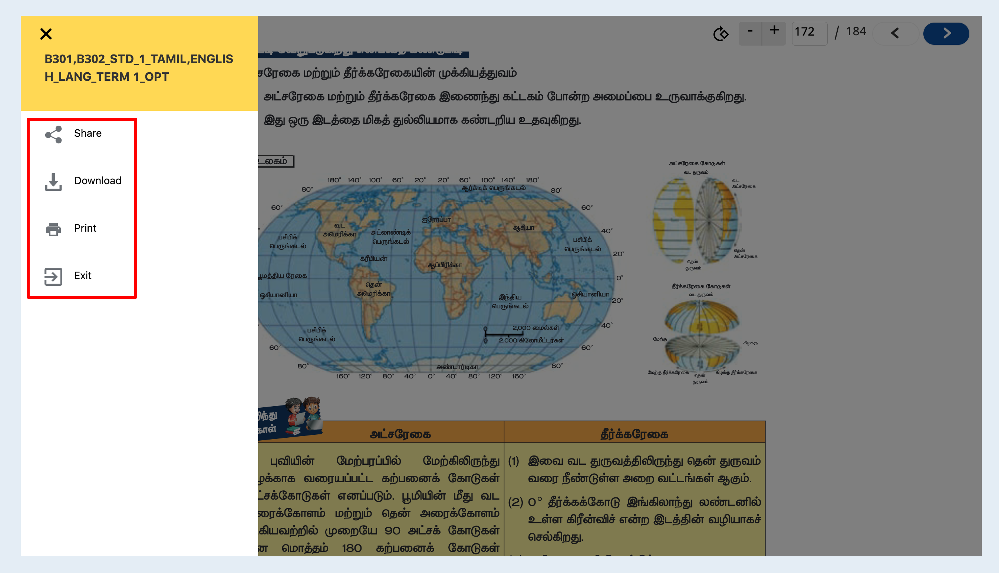

# Features

<details>

<summary>Zoom</summary>

This zoom feature has the ability to view given pdf content in a much larger and smaller view.\


</details>

<details>

<summary><strong>Rotate</strong></summary>

This rotate feature has the ability to rotate given pdf content based on some angle(as of now 90 degree rotation)\


</details>

<details>

<summary>Navigate</summary>

This navigate feature will provide the user to jump to any number of page in given pdf content and also able view previous and next page from given page.\
.png>)

</details>

<details>

<summary>Progress</summary>

This feature will help us to understand how much percentage (%) of content I have read.png>)

</details>

<details>

<summary>Side Menu</summary>

This player has the side menu feature like share, download and etc based input config provided.\


sample config to enable is

```
"config": {  
    "sideMenu": { 
      "showShare": true, // show/hide share button in side menu. default value is true
      "showDownload": true, // show/hide download button in side menu. default value is true
      "showExit": false, // show/hide exit button in side menu. default value is false
      "showPrint": true // show/hide print button in side menu. default value is true
    }
}
```

</details>
