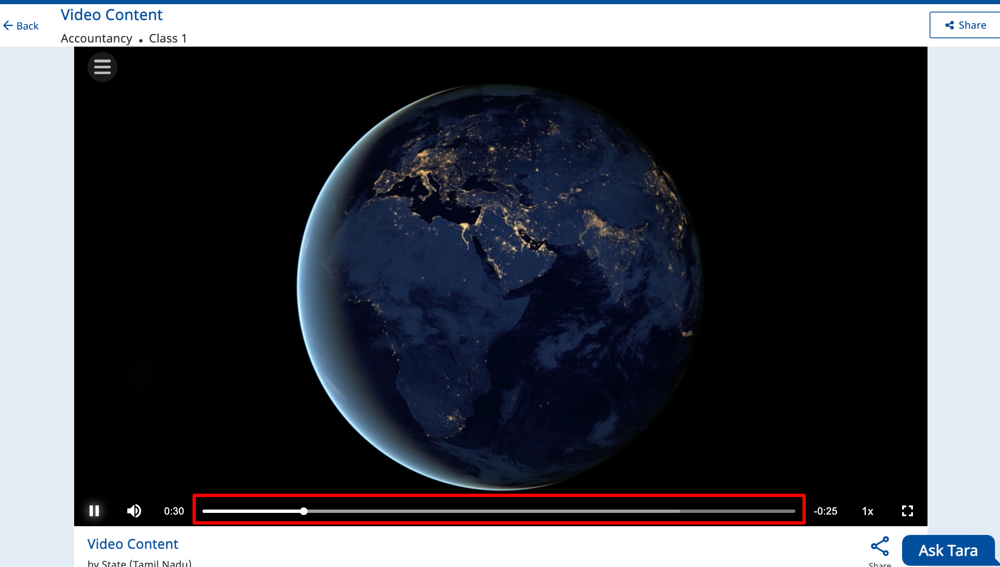
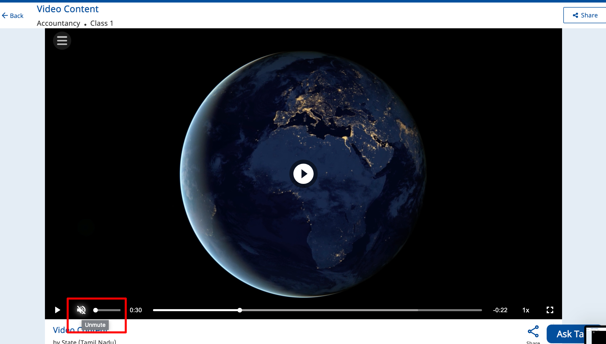
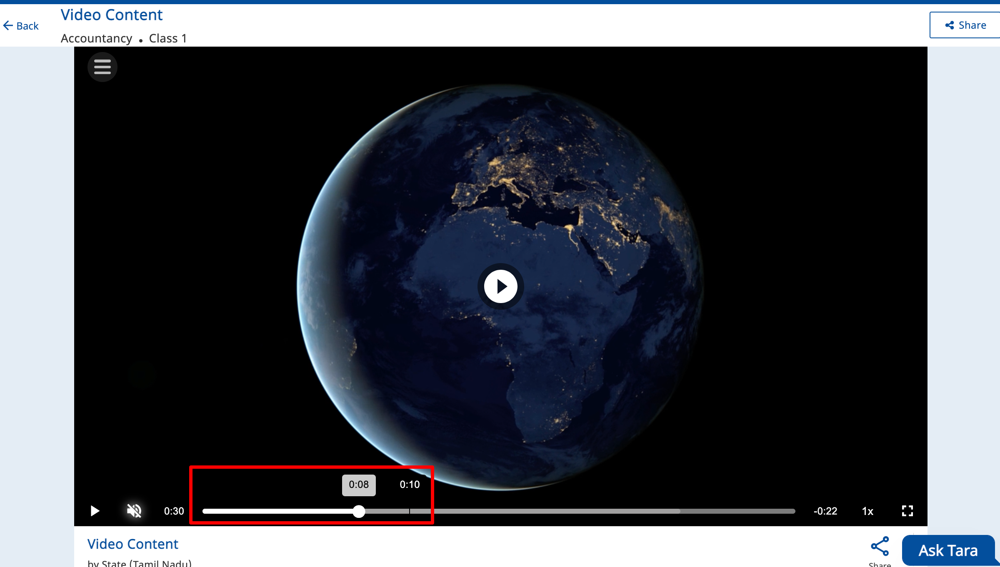
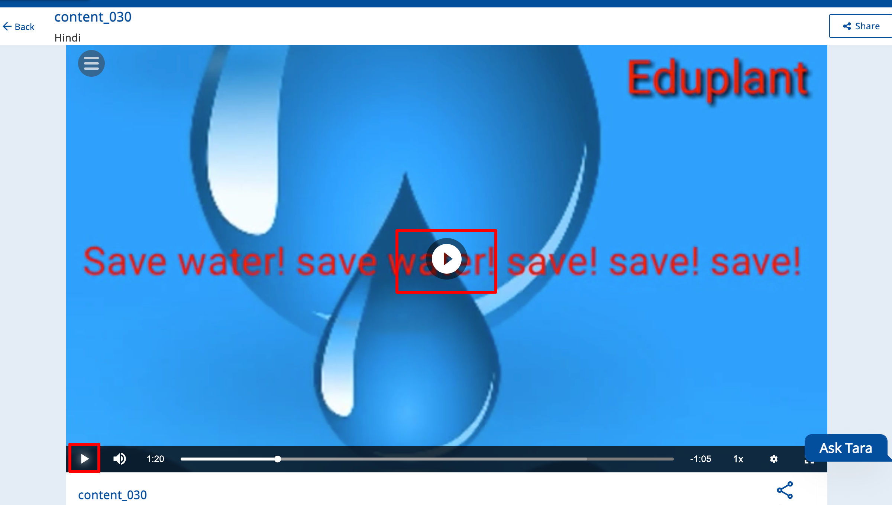
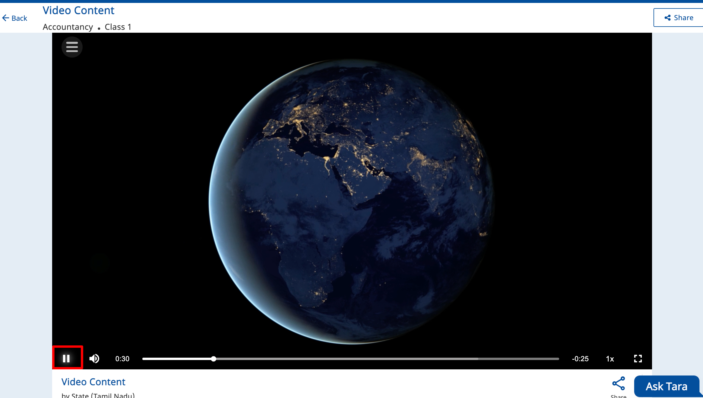
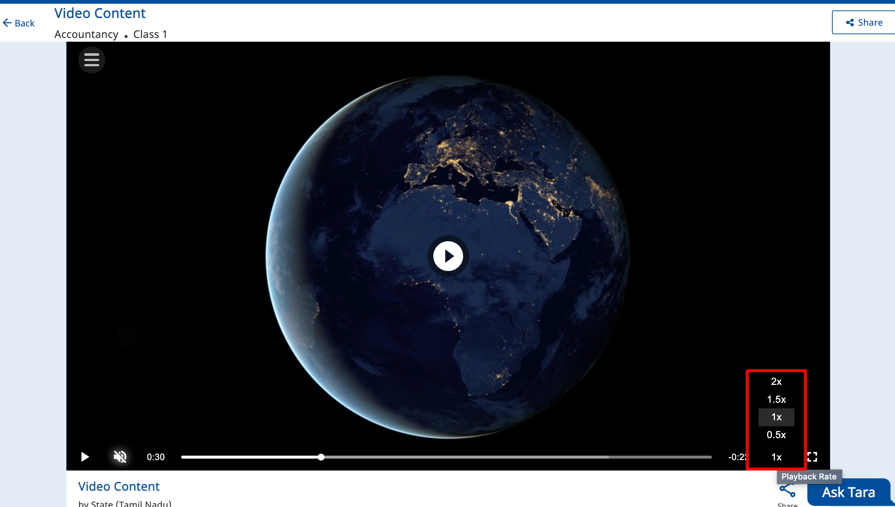

# Video Player

Video player enables playing of video content.&#x20;

### Tech Stack

1. Angular
2. Typescript
3. Javascript
4. SCSS
5. HTML

## Installation guide


[video-player.md](../../../../../use/installation-guide/players/v2/video-player.md)


### Default Video Features

<strong>Progress Bar</strong>

This feature will help us to understand how much percentage (%) of content I have watched and how much content is loaded.\

<strong>Volume</strong>

This volume feature will be used to increase and decrease sound of the video content.\
\

* **Mute:** This mute feature will used to mute the sound of video.\

* **Unmute**\
  This unmute feature will used to unmute the sound of video.\

<strong>Forward and backward</strong>

This forward and backward feature will help us to play video ahead and back.

<strong>Quality selection</strong>(with streaming) 

This quality selection provides  min and max content quality selection based on streaming  quality options.\

Play/Pause

This feature is used play and pause the content

* **Play** : This feature will help us to play content.\
  \

<!---->

* **Pause**: This feature will help us to pause content.\
  

Playing Rate

This feature will help us play the video at different speeds.

### Git Repo


