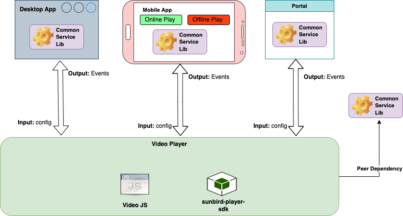

# Architecture

**Common Service Lib:**

This is used for generating the telemetry from the player as a utility dependency library.

**Sunbird Player SDK:**

SDK contains common components used by all the V2 players to make it consistent and reusable across players, It contains Start, End Page components along with Navigation and Side menu components

**Video JS:**\
This library helps in playing the video files and with help of the plugins, we can stream the video with different resolutions and at different speed rates and it helps with other common features of video play. Refer [here](https://github.com/videojs/video.js) for more details.
