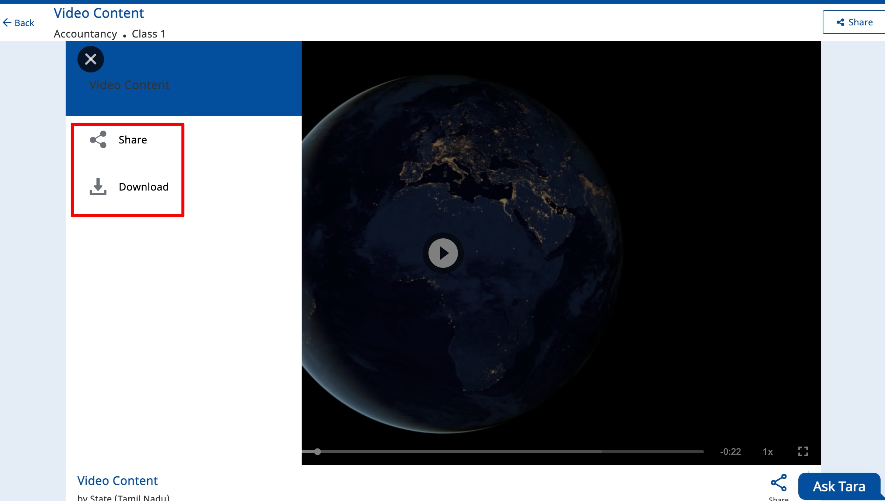
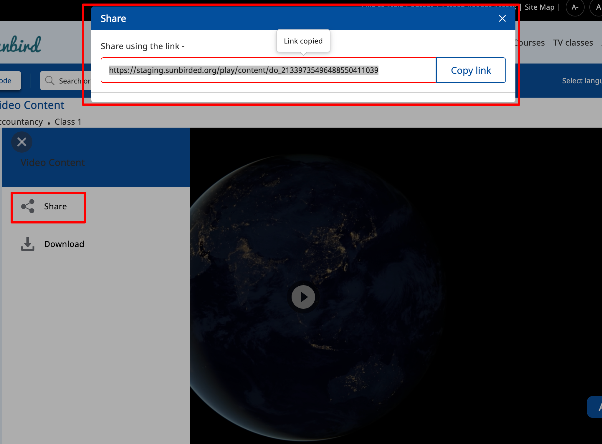
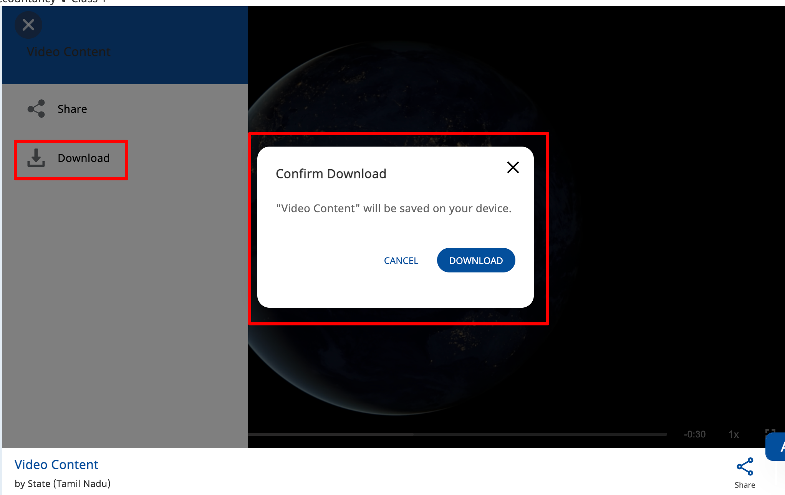

# Features


<details>

<summary>Side Menu</summary>

This player has the side menu feature like share, download and etc based input config provided.\
\
****

*   **Share**: \
    &#x20;This share feature is used to help share content link. and the default value is true.\


    sample config to enable is\
    ****&#x20;

    ```
    "config": { 
        "sideMenu": { 
          "showShare": true, // show/hide share button in side menu. default value is false     
        }
    }
    ```

    \
    \


<!---->

*   **Download**\
    ****This download feature helps to download content and the default value is true.\


    sample config to enable is\
    **** &#x20;

    ```
    "config": {
         "sideMenu": {      
          "showDownload": true, // show/hide download button in side menu. default value is true  
        }
    }
    ```

    ****\
    ****

</details>
