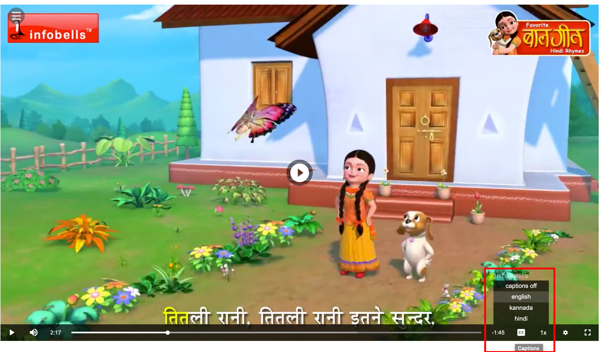
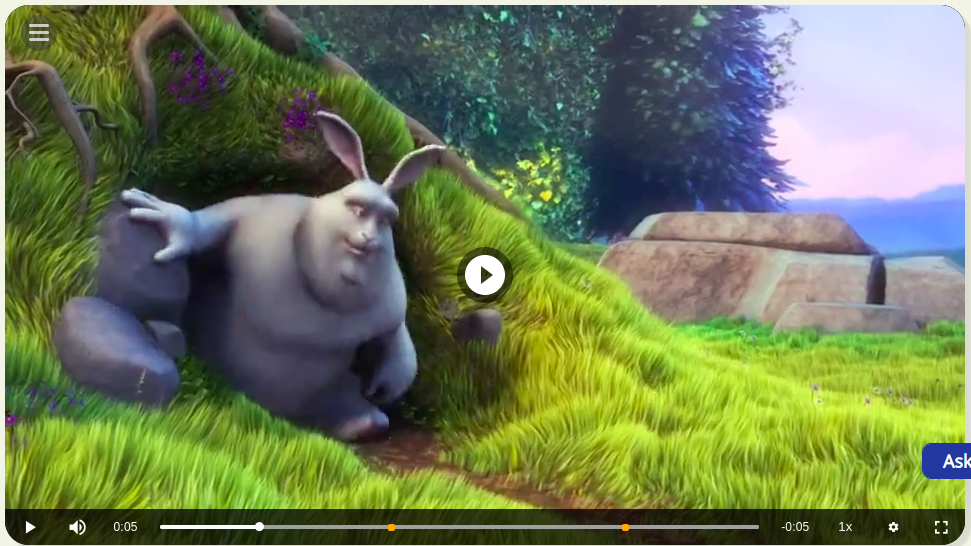
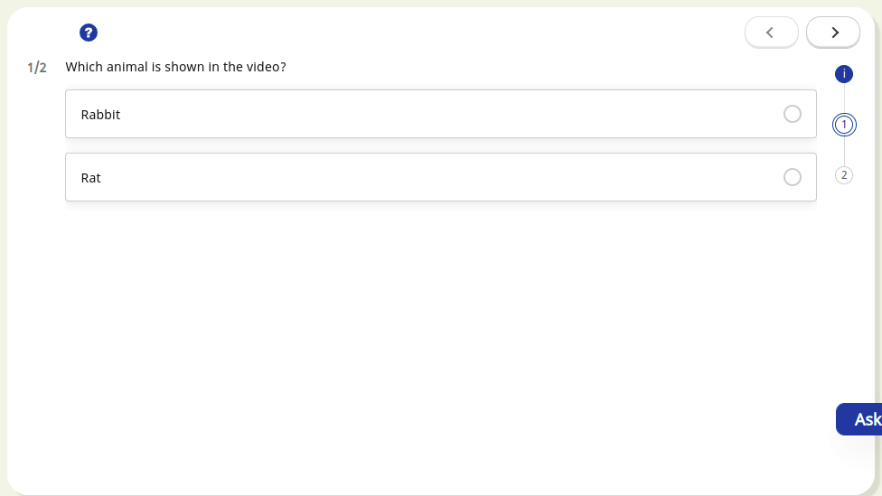

# Features

<details>

<summary><strong>Progress Bar</strong></summary>


In the side menu, one can configure additional capabilities such as 'Share', 'Download'xt and 'Print'. \


Sample config:

```
"config": {  
    "sideMenu": { 
      "showShare": true, // show/hide share button in side menu. default value is true
      "showDownload": true, // show/hide download button in side menu. default value is true
      "showExit": false, // show/hide exit button in side menu. default value is false
      "showPrint": true // show/hide print button in side menu. default value is true
    }
}
```

</details>

<details>

<summary>Volume</summary>


This volume feature will be used to increase and decrease sound of the video content.\
\


* **Mute:** This mute feature will used to mute the sound of video.\

* **Unmute**\
  This unmute feature will used to unmute the sound of video.

</details>

<details>

<summary><strong>Forward and backward</strong></summary>

This forward and backward feature will help us to play video ahead and back.

</details>

<details>

<summary><strong>Quality selection</strong>(with streaming) </summary>

This quality selection provides  min and max content quality selection based on streaming  quality options.\
.png>)

</details>

<details>

<summary>Play/Pause</summary>


This feature is used play and pause the content

* **Play** : This feature will help us to play content.\
  \


<!---->

* **Pause**: This feature will help us to pause content.\
  

</details>

<details>

<summary>Playing Rate</summary>

This feature will help us play the video at different speeds.

</details>

<details>

<summary>Duration</summary>

This feature will help us to get the video duration and use it.

</details>
    
<details>

<summary>Subtitle selection(captions)</summary>

This feature will help us to select the subtitle for different languages provided by content.\
\
The design and implementation document  [link](https://project-sunbird.atlassian.net/wiki/spaces/SBDES/pages/3183411217/Enable+transcripts+sub-title+in+video+player)&#x20;

</details>
    
<details>

<summary>Interactive Video Support (with QuestionSets)</summary>

Using this feature, we can make the videos interactive, by adding Question-Sets at certain points.  As a result, the user will be able to interact with the video.\

\
The design and implementation document [link](https://project-sunbird.atlassian.net/wiki/spaces/PRD/pages/3193962714/Enable+Question-Sets+for+video+content)&#x20;

</details>

