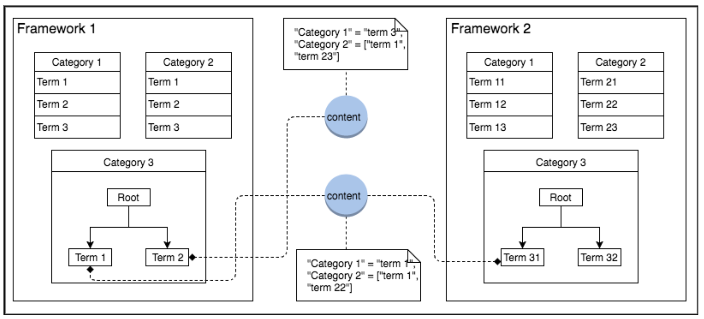

# Add Content to Framework

ABC organization, is a global conglomerate that works in the domain of education and collaborates with different institutions, NGOs and academicians around the world. The primary vision of organizing and enabling seamless discoverability of the content, they decide to implement a framework. As in the process, a framework is already created which is empty. Subsequently, the users must to be able to assign group or categorise programs according to industry, condition, specialty and focus. This information will be used to track against our key condition growth goals, grant and other reporting, and for research and evaluation purposes

* Content needs to be categorized. Lectures, case presentations, and supplemental documents need to be labeled so they can be added to categories related to label.
* New programs in existing topic areas should be able to easily find appropriate top-rated lectures to add to their sessions.

With huge resource library and based on ABC organizations decision, they want to classify their content based on categories as and subcategories. The framework needs to be seeded as per their proposed classification.

| FRAMEWORK NAME | CATEGORIES            | TERMS                               |
| -------------- | --------------------- | ----------------------------------- |
| ABC            | Resources             | Ground Water, Spring, Surface Water |
|                | Governance            | Ground Water, Spring, Surface Water |
|                | Measurement & Mapping | Ground Water, Spring, Surface Water |
|                | Funds                 | State, Central, Global              |
|                | Management            | Ground Water, Spring, Surface Water |

ABC, may choose a predefined category and associate it to their own framework. The categories in the framework has terms associated with it. These terms are relevant to the created framework and can be created by the organization.

After you create a framework, it must be seeded with the required data classified under different components such as:

* Categories
* Terms\
  Once the framework is successfully seeded, then it must be associating with terms and categories.

<figure><figcaption></figcaption></figure>

> **Note**: It is recommended that there is a preplanned classification of content and their associations, this ensures that the framework is usable across the system.

#### Prerequisites <a href="#prerequisites" id="prerequisites"></a>

1.  &#x20;

    An intialized Sunbird instance with channel
2.  &#x20;

    API Key to access Sunbird APIs. To create an API key refer [How to generate a Sunbird API key](../../../player/telemetry-events/generate-api-keys.md)
3.  &#x20;

    Software that can make API calls like curl or [POSTMAN](https://www.getpostman.com/docs/v6/postman/api\_documentation/intro\_to\_api\_documentation)
4.  &#x20;

    Onboarding the following with access to the API

    * Admin user
    * Individual User
    * Individual Organization access
    * Map users to the organization
5.  &#x20;

    Access to [Framework API](https://documenter.getpostman.com/view/25463377/2s8ZDa32ay#2985d446-cd84-497a-b7dd-d965be66c6bf)
6.  &#x20;

    Follow the steps as mentioned in [Using POSTMAN](https://www.getpostman.com/docs/v6/postman/api\_documentation/intro\_to\_api\_documentation) section to execute the Create Term API

#### Taskflow <a href="#taskflow" id="taskflow"></a>

In this context, the category objects forms the master of all categories and can be inherited by any framework. Each master list category has the list of all possible category values. You can either choose to use the default values for a category of your framework or override them as per the framework context using the appropriate API.

For example, for ABC organization the framework name is ABC and code as abc1; select the category as subject and change the label as Resource type which defines the various water resources and contains the terms as rain water, lake, ponds and so on.

A term is created for each value of a category instance: Terms are used to tag content and other platform objects. The order of terms within a category is defined using the sequence relation between category instance and the term in the request payload of creating term API.

The following are the various properties associated with each term:

* name: name of the term
* code: unique code of the term, which will be validated from master category
* category: category of the term
* translations: translations for the term in different languages
* index: order of display of the term
* description: description of the term

Each term can have relationship with framework category and terms:

* categories: list of framework category
* parents: list of parent term
* children: list of child terms
* associations: list of terms associated from other the other category

#### Adding Category <a href="#adding-category" id="adding-category"></a>

To add a category follow these steps:

1. Check for the existing categories, to do so use [Fetch Category API](https://documenter.getpostman.com/view/25463377/2s8ZDa32ay#b0f45dd1-dd24-47d5-8800-e544a2cf7d50) For your reference, the following is the list of default categories:
   * class
   * medium
   * subject
   * gradelevel
   * topic
2.  Create a new category by using [Create category API](https://documenter.getpostman.com/view/25463377/2s8ZDa32ay#7b07da54-506c-410e-a263-63d3b5522f38), ensure to provide the appropriate value for “code” parameter in the request payload. The code parameter inherits the master category schema.&#x20;

    > **Note**: You can only create a new category using any of the available master list categories. If you want to create a new master category, send an email to support@sunbird.org
3.  &#x20;

    Provide the valid input for the query parameters **framework**. Append the parameter to the endpoint request URI while you are sending the API request
4. Also, provide the appropriate values for the request body parameters in the payload

**Request Body for creating framework category:**

1.  &#x20;

    Path for creating framework : `POST: /framework/v1/category/create?framework=abc1`

    &#x20;

    { “request”: { “category”:{ “name”:”Resource”, “description”:”Resource category of the framework”, “code”:”subject”, “translations”: “{"en":"resource"}” } } }

**Response Body**

```
  {
    "id": "api.category.create",
    "ver": "1.0",
    "ts": "2018-11-19T11:00:57.914Z",
    "params": {
        "resmsgid": "64b331a0-ebea-11e8-8676-f72d022164ed",
        "msgid": "649b63e0-ebea-11e8-b107-49a5bcd087db",
        "status": "successful",
        "err": null,
        "errmsg": null
    },
    "responseCode": "OK",
    "result": {
        "node_id": "abc1_subject",
        "versionKey": "1542625257776"
    }
}

```

**Description of Parameters**

Name: name of the category Code: unique code of the category. This gets validated from the mater category Description: Description of the category Translations: Depicts the transalation of the category in different language

Other operation that you can perform on the categories under a framework are as follows:

[Fetch](https://documenter.getpostman.com/view/25463377/2s8ZDa32ay#ad0a76cb-4e31-4a8c-b472-de365af2de11) [Update](https://documenter.getpostman.com/view/25463377/2s8ZDa32ay#f16ade99-c9cd-4055-a251-5d8c996e3258) [Search](https://documenter.getpostman.com/view/25463377/2s8ZDa32ay#1770618a-936f-4014-be98-25dd34fa96e6)

#### Adding Terms <a href="#adding-terms" id="adding-terms"></a>

1. To create a new term refer to [Create Term API](https://documenter.getpostman.com/view/25463377/2s8ZDa32ay#43c4fb52-a4d6-486c-beec-6c262571bf4a). Given below is an example of request body for creating terms

The categories can be retrieved and listed using [Fetch API](https://documenter.getpostman.com/view/25463377/2s8ZDa32ay#ad0a76cb-4e31-4a8c-b472-de365af2de11)

1.  &#x20;

    Provide the valid input for the query parameters “framework” and “category”. Append these parameters to the endpoint request URL while you are sending the API request.
2.  &#x20;

    Provide the appropriate values for the request body parameters in the payload.

> **Note**: The sample values provided in the request body are indicative.

**Request Body for creating Terms**

`POST: /framework/v1/term/create?framework=abc1&category=subject`

```
  {
    "request": {
        "term": [
            {
                "code": "river",
                "name": "River",
                "description":"Describes River",
                "translations": "{\"en\":\"river\"}"
            },
            {
                "code": "sea",
                "name": "Sea",
                "description":"Describes Sea",
                "translations": "{\"en\":\"sea\"}"
            }
        ]
    }
}

```

**Response Body**

```
  {
    "id": "api.term.create",
    "ver": "1.0",
    "ts": "2018-11-19T11:21:37.973Z",
    "params": {
        "resmsgid": "47d52e50-ebed-11e8-8676-f72d022164ed",
        "msgid": "47ba5350-ebed-11e8-b107-49a5bcd087db",
        "status": "successful",
        "err": null,
        "errmsg": null
    },
    "responseCode": "OK",
    "result": {
        "node_id": [
            "abc1_subject_river",
            "abc1_subject_sea"
        ]
    }
}  

```

**Description of Parameters**

Code: Unique value that is used for generating term identifier. Description: Description of the term Name: Name of the terms Translations: Transalation of the category in different language

Other operations that can be performed on terms of a category within a framework are as follows:

[Fetch](https://documenter.getpostman.com/view/25463377/2s8ZDa32ay#ad0a76cb-4e31-4a8c-b472-de365af2de11)

[Update](https://documenter.getpostman.com/view/25463377/2s8ZDa32ay#f16ade99-c9cd-4055-a251-5d8c996e3258)

[Search](https://documenter.getpostman.com/view/25463377/2s8ZDa32ay#1770618a-936f-4014-be98-25dd34fa96e6)

#### Publishing Framework <a href="#publishing-framework" id="publishing-framework"></a>

1.  &#x20;

    Once a framework is associated with its category and terms, it has to be published. Until it is published, the changes will not be available in the framework get API call.
2.  &#x20;

    Given below is the publish framework API sample request and response. Framework has to be passed as a query parameter and the request body should be blank.

> **Note**: The sample values provided in the request body are indicative.

**Request Body for creating Terms**

`POST: /framework/v1/publish/abc1`

```
  {}


```

`Response Body`

```
  {
    "id": "api.framework.publish",
    "ver": "1.0",
    "ts": "2018-11-20T15:23:31.724Z",
    "params": {
        "resmsgid": "3d1d94c0-ecd8-11e8-8ee7-23985149ff3f",
        "msgid": "3d1b23c0-ecd8-11e8-b9fd-f7a268445f06",
        "status": "successful",
        "err": null,
        "errmsg": null
    },
    "responseCode": "OK",
    "result": {
        "publishStatus": "Publish Operation for Framework Id 'abc1' Started Successfully!"
    }
}

```

Note: Once the framework is published, all the changes will be available in the framework get API.

### Concepts Covered <a href="#concepts-covered" id="concepts-covered"></a>

[How do I create a framework](create-framework.md)
